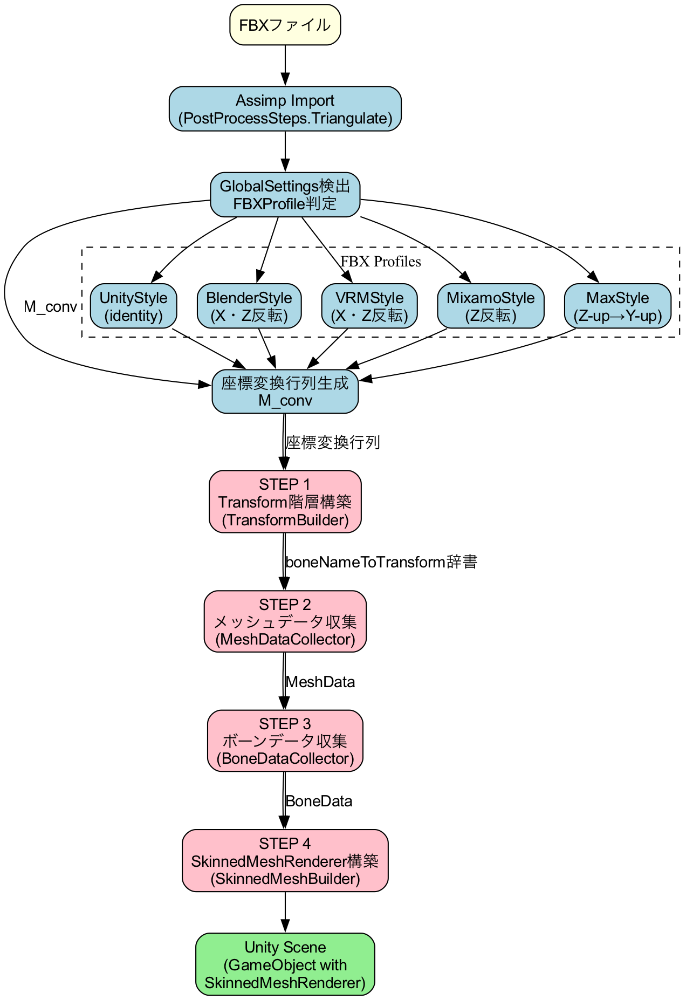
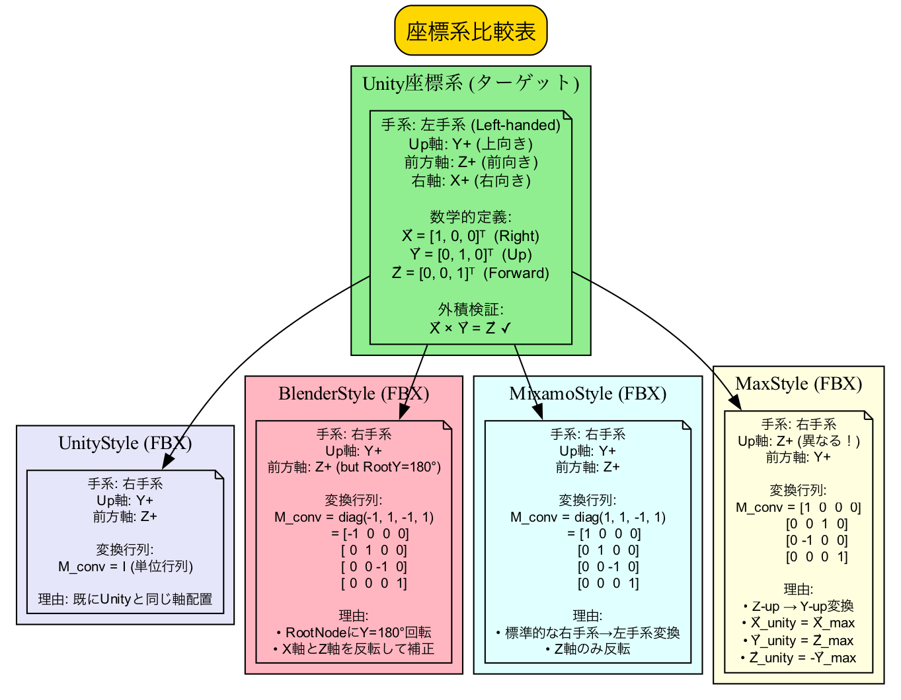
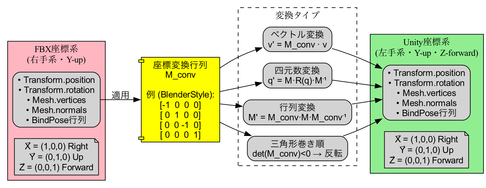
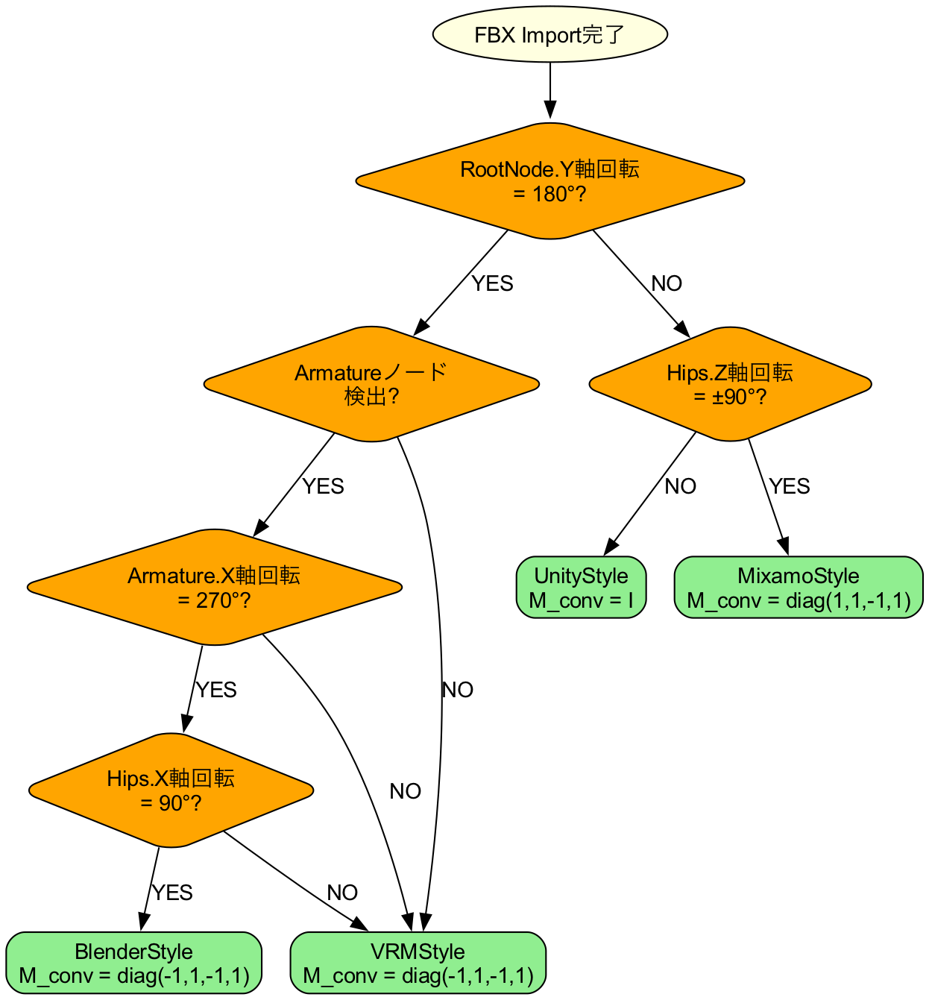
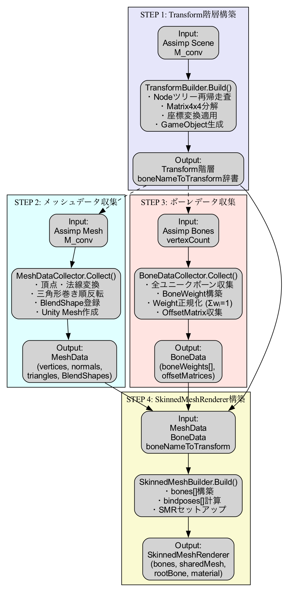
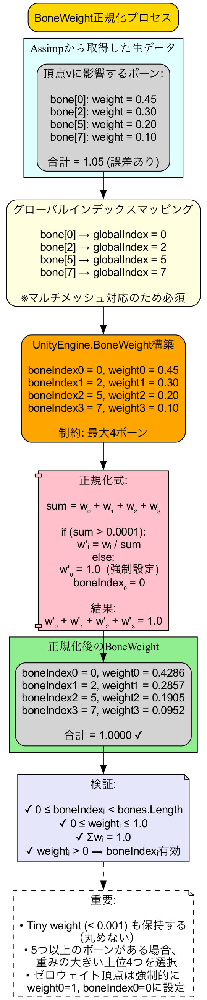
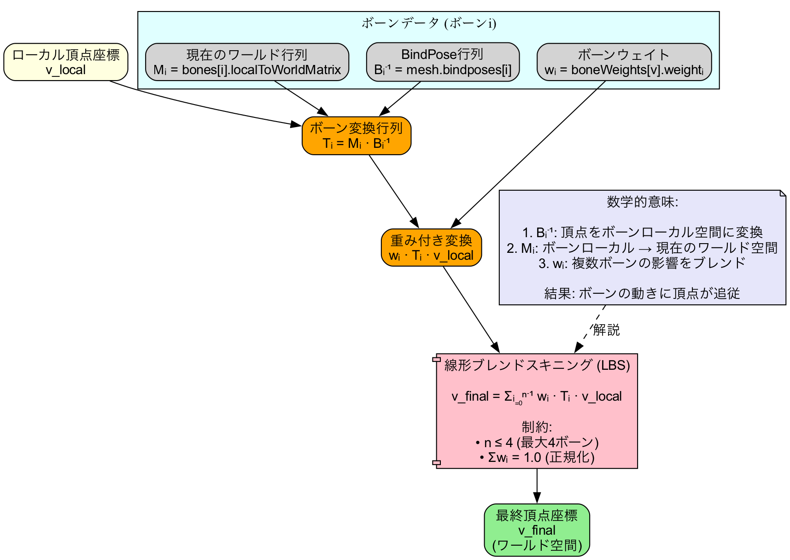
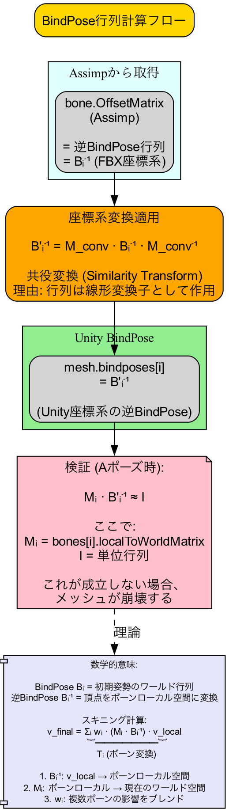

# FBXインポートアーキテクチャ設計書

## 目次

1. [概要と設計原則](#1-概要と設計原則)
2. [座標系変換の数学的基礎](#2-座標系変換の数学的基礎)
3. [GlobalSettings検出とプロファイリング](#3-globalsettings検出とプロファイリング)
4. [4ステップインポートパイプライン](#4-4ステップインポートパイプライン)
5. [SkinnedMeshRenderer構築の数学](#5-skinnedmeshrenderer構築の数学)
6. [設計上の重要な制約](#6-設計上の重要な制約)
7. [トラブルシューティングガイド](#7-トラブルシューティングガイド)

---

## 1. 概要と設計原則

### 1.1 基本方針

**「スキニング問題の80%はTransformの破綻が原因」**

この原則に基づき、本システムは以下の階層的アプローチを採用します：

```
優先度1: Transform階層の正確な構築（座標系変換）
  ↓
優先度2: Mesh頂点データの変換
  ↓
優先度3: BindPose行列の計算
  ↓
優先度4: SkinnedMeshRendererのセットアップ
```

### 1.2 アーキテクチャ概要



*図1-1: FBXインポートの全体フロー*

### 1.3 設計原則

| 原則 | 説明 | 実装クラス |
|-----|------|-----------|
| **単一責任の原則** | 各クラスは1つの変換ステップのみ担当 | TransformBuilder, MeshDataCollector, etc. |
| **不変性の原則** | 座標変換行列は一度生成したら変更しない | FbxCoordinateSystemDetector |
| **早期検証の原則** | エラーは可能な限り早い段階で検出 | 各ステップでのバリデーション |
| **座標系の一貫性** | 全データに同一の変換行列を適用 | coordinateConversionMatrix |

---

## 2. 座標系変換の数学的基礎

### 2.1 座標系の定義

#### Unity座標系（ターゲット）

```
座標系: 左手系 (Left-handed)
Up軸:   Y+ (上向き)
前方軸: Z+ (前向き)
右軸:   X+ (右向き)

数学的定義:
  X⃗_unity = [1, 0, 0]ᵀ  (Right)
  Y⃗_unity = [0, 1, 0]ᵀ  (Up)
  Z⃗_unity = [0, 0, 1]ᵀ  (Forward)
```



*図2-1: 座標系の比較*

#### FBX座標系（ソース）

FBXは複数の座標系をサポート：

| プロファイル | Up軸 | 前方軸 | 手系 | 用途 |
|------------|------|-------|-----|------|
| **UnityStyle** | Y+ | Z+ | 右手系 | Unity標準エクスポート |
| **BlenderStyle** | Y+ | -Z | 右手系 | Blender（180°Y回転） |
| **VRMStyle** | Y+ | Z+ | 右手系 | VRM（180°Y回転） |
| **MixamoStyle** | Y+ | Z+ | 右手系 | Mixamo（Z軸回転） |
| **MaxStyle** | Z+ | Y+ | 右手系 | 3ds Max |

### 2.2 変換行列の数学

#### 基本変換行列

座標系変換行列 `M_conv` は以下のように構築されます：

```
M_conv = M_flip × M_basis

ここで：
  M_basis: 基底ベクトル変換行列
  M_flip:  手系反転行列
```

#### (1) 基底ベクトル変換

FBX基底 `{X⃗_fbx, Y⃗_fbx, Z⃗_fbx}` から Unity基底 `{X⃗_unity, Y⃗_unity, Z⃗_unity}` への変換：

```
M_basis = [X⃗_fbx | Y⃗_fbx | Z⃗_fbx]

例: Blender (Y-up, -Z forward)
M_basis = [1  0  0  0]
          [0  1  0  0]
          [0  0 -1  0]
          [0  0  0  1]
```

#### (2) 手系反転（Right-handed → Left-handed）

```
M_flip = [1  0  0  0]
         [0  1  0  0]
         [0  0 -1  0]
         [0  0  0  1]

理由: 右手系→左手系変換ではZ軸を反転
```

#### (3) プロファイル別変換行列

**UnityStyle（変換不要）**

```
M_conv = I (単位行列)

理由: 既にUnity座標系と同じ
```

**BlenderStyle（X・Z反転）**

```
M_conv = [-1  0  0  0]
         [ 0  1  0  0]
         [ 0  0 -1  0]
         [ 0  0  0  1]

理由:
- RootNodeにY=180°回転が含まれる
- X軸とZ軸を反転してキャンセル
```

**VRMStyle（X・Z反転）**

```
M_conv = [-1  0  0  0]
         [ 0  1  0  0]
         [ 0  0 -1  0]
         [ 0  0  0  1]

理由: BlenderStyleと同様
```

**MixamoStyle（Z反転のみ）**

```
M_conv = [1  0  0  0]
         [0  1  0  0]
         [0  0 -1  0]
         [0  0  0  1]

理由: 標準的な右手系→左手系変換
```

**MaxStyle（Z-up → Y-up変換）**

```
M_conv = [1  0  0  0]
         [0  0  1  0]
         [0 -1  0  0]
         [0  0  0  1]

導出:
  X⃗_unity = X⃗_max        = [1, 0, 0]ᵀ
  Y⃗_unity = Z⃗_max        = [0, 0, 1]ᵀ
  Z⃗_unity = -Y⃗_max       = [0,-1, 0]ᵀ
```

### 2.3 ベクトル・四元数・行列変換



*図2-2: 座標変換の適用プロセス*

#### ベクトル変換

```
v⃗_unity = M_conv · v⃗_fbx

実装:
Vector3 ConvertVector(Assimp.Vector3D v, Matrix4x4 M)
{
    return M.MultiplyPoint3x4(new Vector3(v.X, v.Y, v.Z));
}
```

#### 四元数変換

四元数 `q` は回転を表すため、座標系変換は以下のように行います：

```
R_fbx = Quaternion_to_Matrix(q_fbx)
R_unity = M_conv × R_fbx × M_conv⁻¹
q_unity = Matrix_to_Quaternion(R_unity)

数学的証明:
  v⃗'_fbx = R_fbx · v⃗_fbx
  v⃗'_unity = M_conv · v⃗'_fbx
           = M_conv · R_fbx · v⃗_fbx
           = M_conv · R_fbx · M_conv⁻¹ · (M_conv · v⃗_fbx)
           = R_unity · v⃗_unity
```

実装:

```csharp
Quaternion ConvertQuaternion(Assimp.Quaternion q, Matrix4x4 M)
{
    Quaternion qUnity = new Quaternion(q.X, q.Y, q.Z, q.W);
    Matrix4x4 R = Matrix4x4.Rotate(qUnity);
    Matrix4x4 R_conv = M * R * M.inverse;
    return R_conv.rotation;
}
```

#### 行列変換

4×4変換行列の変換：

```
M_unity = M_conv × M_fbx × M_conv⁻¹

理由: 行列は線形変換子として作用するため、
      共役変換（similarity transformation）が必要
```

### 2.4 三角形の巻き順反転

座標変換行列の行列式が負の場合、手系が反転するため三角形の巻き順を反転する必要があります：

```
det(M_conv) < 0  ⟹  三角形インデックスを反転

変換前: [v₀, v₁, v₂]
変換後: [v₀, v₂, v₁]

数学的理由:
  左手系では反時計回り = 表面
  右手系では時計回り = 表面
  手系変換時に巻き順を保つため反転が必要
```

実装:

```csharp
float determinant = coordinateConversionMatrix.determinant;
bool shouldFlipWinding = determinant < 0f;

if (shouldFlipWinding)
{
    triangles.Add(idx0);
    triangles.Add(idx2);  // idx1とidx2を入れ替え
    triangles.Add(idx1);
}
```

---

## 3. GlobalSettings検出とプロファイリング

### 3.1 FBXProfile自動判定アルゴリズム

#### 判定フロー



*図3-1: FBXプロファイル自動判定フローチャート*

#### ルール詳細

**Rule 1: RootNode Y=180° 判定**

```csharp
Vector3 rootEuler = GetEulerFromAssimpMatrix(rootNode.Transform);
bool hasY180 = Mathf.Abs(rootEuler.y - 180f) < 5f;

if (hasY180)
{
    // BlenderStyle or VRMStyle候補
    goto Rule2;
}
```

**理由**: Blender/VRMエクスポート時、Z軸方向の差異を補正するためRootNodeにY=180°回転が追加される

**Rule 2: Armature X=270° 判定**

```csharp
Node armature = FindNodeByName(rootNode, "Armature");
if (armature != null)
{
    Vector3 armEuler = GetEulerFromAssimpMatrix(armature.Transform);
    bool hasX270 = Mathf.Abs(armEuler.x - 270f) < 5f;

    if (hasX270)
    {
        // BlenderStyle候補
        goto Rule3;
    }
}
```

**理由**: BlenderのデフォルトエクスポートではArmature（リグルート）にX=270°（-90°）回転が含まれる

**Rule 3: Hips X=90° 判定**

```csharp
Node hips = FindNodeByName(armature, "Hips");
if (hips != null)
{
    Vector3 hipsEuler = GetEulerFromAssimpMatrix(hips.Transform);
    bool hasX90 = Mathf.Abs(hipsEuler.x - 90f) < 5f;

    if (hasX90)
    {
        return FBXProfile.BlenderStyle;
    }
}
```

**理由**: BlenderのHipsボーンはX=90°回転で前方方向を補正

**Rule 4: Mixamo判定（Hips Z=±90°）**

```csharp
Node hips = FindNodeByName(rootNode, "Hips");
if (hips != null)
{
    Vector3 hEuler = GetEulerFromAssimpMatrix(hips.Transform);
    if (Mathf.Abs(hEuler.z - 90f) < 5f || Mathf.Abs(hEuler.z + 90f) < 5f)
    {
        return FBXProfile.MixamoStyle;
    }
}
```

**理由**: MixamoキャラクターはHipsにZ軸回転が含まれる

### 3.2 座標系プロファイル構造

```csharp
public struct FbxCoordProfile
{
    public Vector3 up;              // 上方向ベクトル
    public Vector3 front;           // 前方向ベクトル
    public Vector3 right;           // 右方向ベクトル
    public bool isRightHanded;      // 右手系フラグ
    public string profileName;      // プロファイル名
    public FBXProfile profileType;  // プロファイル種別
}
```

#### プロファイル定義表

| Profile | up | front | right | isRightHanded | 備考 |
|---------|----|----|----|----|------|
| UnityStyle | (0,1,0) | (0,0,1) | (1,0,0) | true | 変換不要 |
| BlenderStyle | (0,1,0) | (0,0,1) | (1,0,0) | true | X・Z反転 |
| VRMStyle | (0,1,0) | (0,0,1) | (1,0,0) | true | X・Z反転 |
| MixamoStyle | (0,1,0) | (0,0,1) | (1,0,0) | true | Z反転のみ |
| MaxStyle | (0,0,1) | (0,1,0) | (1,0,0) | true | Z-up変換 |

### 3.3 GlobalSettings拡張（将来実装）

現在は構造解析による判定ですが、将来的にはFBXメタデータからの直接読み取りを実装可能：

```csharp
// 将来実装例
if (scene.Metadata.HasKey("UpAxis"))
{
    int upAxis = scene.Metadata.GetInt("UpAxis");
    int frontAxis = scene.Metadata.GetInt("FrontAxis");
    int coordAxis = scene.Metadata.GetInt("CoordAxis");

    // GlobalSettingsから直接座標系を決定
    profile = BuildProfileFromMetadata(upAxis, frontAxis, coordAxis);
}
```

---

## 4. 4ステップインポートパイプライン

### 4.1 全体フロー



*図4-1: 4ステップインポートパイプライン詳細*

```
┌─────────────────────────────────────────────────────────────┐
│ FBX Import Pipeline                                         │
│                                                             │
│  Input: FBXファイルパス                                       │
│    ↓                                                        │
│  [Assimp Import]                                           │
│    ↓                                                        │
│  [GlobalSettings検出] → coordinateConversionMatrix         │
│    ↓                                                        │
│  ┌─────────────────────────────────────────────────────┐  │
│  │ STEP 1: Transform階層構築                            │  │
│  │  - TransformBuilder                                  │  │
│  │  - 座標変換適用                                        │  │
│  │  - boneNameToTransform辞書作成                        │  │
│  └─────────────────────────────────────────────────────┘  │
│    ↓                                                        │
│  ┌─────────────────────────────────────────────────────┐  │
│  │ STEP 2: メッシュデータ収集                            │  │
│  │  - MeshDataCollector                                 │  │
│  │  - 頂点・UV・法線変換                                  │  │
│  │  - BlendShape登録                                     │  │
│  │  - Unity Mesh作成                                     │  │
│  └─────────────────────────────────────────────────────┘  │
│    ↓                                                        │
│  ┌─────────────────────────────────────────────────────┐  │
│  │ STEP 3: ボーンデータ収集                              │  │
│  │  - BoneDataCollector                                 │  │
│  │  - BoneWeight正規化                                   │  │
│  │  - OffsetMatrix収集                                   │  │
│  └─────────────────────────────────────────────────────┘  │
│    ↓                                                        │
│  ┌─────────────────────────────────────────────────────┐  │
│  │ STEP 4: SkinnedMeshRenderer構築                      │  │
│  │  - SkinnedMeshBuilder                                │  │
│  │  - bones配列構築                                       │  │
│  │  - BindPose計算                                       │  │
│  │  - SMR設定                                            │  │
│  └─────────────────────────────────────────────────────┘  │
│    ↓                                                        │
│  Output: Unity GameObject (スキンメッシュ付き)               │
└─────────────────────────────────────────────────────────────┘
```

### 4.2 STEP 1: Transform階層構築

#### 責務

- Assimp Nodeツリー → Unity Transform階層への変換
- 座標系変換の適用
- ボーン名→Transform辞書の作成

#### 処理フロー

Transform階層構築の詳細は図4-1のSTEP 1を参照してください。

#### 数学的処理

**Assimp行列の分解**

```
M_assimp = T · R · S

ここで:
  T: 平行移動行列
  R: 回転行列
  S: スケール行列

Assimpは Decompose() メソッドで自動分解:
  (s, r, p) = m.Decompose()
```

**座標変換の適用**

```csharp
// Position変換
Vector3 pos_unity = M_conv · pos_assimp
  = M_conv.MultiplyPoint3x4(pos_assimp)

// Rotation変換（共役変換）
R_unity = M_conv × R_assimp × M_conv⁻¹
q_unity = Matrix_to_Quaternion(R_unity)

// Scale（座標系依存しない）
scale_unity = scale_assimp
```

#### 重要な設計決定

**Q: なぜTransform階層に座標変換を適用するのか？**

A: SkinnedMeshRendererは以下の計算を行います：

```
v_final = ∑ᵢ wᵢ · (Bᵢ · Mᵢ · Bᵢ⁻¹) · v_local

ここで:
  Bᵢ: i番目のボーンのBindPose行列
  Mᵢ: i番目のボーンの現在のワールド行列
  wᵢ: i番目のボーンのウェイト
```

Transform階層が破綻すると `Mᵢ` が不正になり、メッシュが崩壊します。

### 4.3 STEP 2: メッシュデータ収集

#### 責務

- 頂点・UV・法線の収集と座標変換
- 三角形インデックスの収集（巻き順反転）
- BlendShapeの登録
- Unity Meshの作成

#### データ構造

```csharp
public struct MeshData
{
    public List<Vector3> vertices;    // 座標変換済み
    public List<Vector2> uvs;         // 変換不要
    public List<Vector3> normals;     // 座標変換済み
    public List<int> triangles;       // 巻き順反転済み
    public Mesh unityMesh;            // BlendShape含む
}
```

#### 処理詳細

**頂点変換**

```csharp
for (int i = 0; i < assimpMesh.VertexCount; i++)
{
    Vector3D v = assimpMesh.Vertices[i];
    Vector3 v_unity = ConvertVector(v, M_conv);
    meshData.vertices.Add(v_unity);
}
```

**法線変換**

```csharp
for (int i = 0; i < assimpMesh.VertexCount; i++)
{
    Vector3D n = assimpMesh.Normals[i];
    Vector3 n_unity = ConvertVector(n, M_conv).normalized;
    meshData.normals.Add(n_unity);
}
```

**注意**: 法線は必ず正規化すること（変換後に長さが変わる可能性）

**三角形インデックス変換**

```csharp
if (shouldFlipWinding)
{
    // 巻き順反転（右手系→左手系）
    triangles.Add(face.Indices[0]);
    triangles.Add(face.Indices[2]);  // 反転
    triangles.Add(face.Indices[1]);
}
else
{
    triangles.Add(face.Indices[0]);
    triangles.Add(face.Indices[1]);
    triangles.Add(face.Indices[2]);
}
```

**BlendShape登録**

```csharp
// ⚠️ 重要: sharedMesh設定前に追加すること
for (int i = 0; i < assimpMesh.MeshAnimationAttachmentCount; i++)
{
    MeshAnimationAttachment bs = assimpMesh.MeshAnimationAttachments[i];

    Vector3[] deltaVertices = ConvertBlendShapeVertices(bs.Vertices);
    Vector3[] deltaNormals = ConvertBlendShapeNormals(bs.Normals);

    mesh.AddBlendShapeFrame(bs.Name, 100f, deltaVertices, deltaNormals, null);
}
```

### 4.4 STEP 3: ボーンデータ収集

#### 責務

- 全メッシュから全ユニークボーンを収集
- BoneWeight配列の構築と正規化
- OffsetMatrix（逆バインド行列）の収集



*図4-2: BoneWeight正規化プロセス*

#### データ構造

```csharp
public struct BoneData
{
    public Dictionary<string, Matrix4x4> boneNameToOffsetMatrix;
    public Dictionary<string, int> boneNameToIndex;
    public BoneWeight[] boneWeights;
    public List<string> allUniqueBoneNames;
}
```

#### ボーンインデックスマッピング

複数メッシュが異なるボーンセットを持つ場合、グローバルインデックスを作成：

```
Mesh 0のボーン: [Hips, Spine, LeftArm]  → Global Index [0, 1, 2]
Mesh 1のボーン: [Spine, RightArm, Head] → Global Index [1, 3, 4]

全ユニークボーン: [Hips(0), Spine(1), LeftArm(2), RightArm(3), Head(4)]
```

実装:

```csharp
// 全メッシュからユニークボーンを収集
List<string> allUniqueBoneNames = new List<string>();
for (int meshIdx = 0; meshIdx < node.MeshCount; meshIdx++)
{
    Mesh mesh = scene.Meshes[node.MeshIndices[meshIdx]];
    for (int boneIdx = 0; boneIdx < mesh.BoneCount; boneIdx++)
    {
        string boneName = mesh.Bones[boneIdx].Name;
        if (!allUniqueBoneNames.Contains(boneName))
        {
            allUniqueBoneNames.Add(boneName);
        }
    }
}

// グローバルインデックスマッピング作成
Dictionary<string, int> boneNameToGlobalIndex = new Dictionary<string, int>();
for (int i = 0; i < allUniqueBoneNames.Count; i++)
{
    boneNameToGlobalIndex[allUniqueBoneNames[i]] = i;
}
```

#### BoneWeight正規化

各頂点は最大4つのボーンに影響されます：

```
w₀ + w₁ + w₂ + w₃ = 1.0

正規化式:
  wᵢ' = wᵢ / (w₀ + w₁ + w₂ + w₃)
```

実装:

```csharp
for (int i = 0; i < boneWeights.Length; i++)
{
    BoneWeight bw = boneWeights[i];
    float sum = bw.weight0 + bw.weight1 + bw.weight2 + bw.weight3;

    if (sum > 0.0001f)
    {
        float inv = 1.0f / sum;
        bw.weight0 *= inv;
        bw.weight1 *= inv;
        bw.weight2 *= inv;
        bw.weight3 *= inv;
    }
    else
    {
        // ゼロウェイト頂点は強制的にweight0=1に設定
        bw.weight0 = 1f;
        bw.boneIndex0 = 0;
    }

    boneWeights[i] = bw;
}
```

### 4.5 STEP 4: SkinnedMeshRenderer構築

#### 責務

- bones配列の構築
- BindPose配列の計算
- SkinnedMeshRendererのセットアップ

#### SkinnedMeshRenderer設定順序

**⚠️ 重要: 設定順序を守ること**

```csharp
SkinnedMeshRenderer smr = gameObject.AddComponent<SkinnedMeshRenderer>();

// 1. bones配列を設定
smr.bones = bones;

// 2. sharedMeshを設定（bindposes, boneWeights含む）
smr.sharedMesh = mesh;

// 3. rootBoneを設定（通常はHips）
smr.rootBone = rootBoneTransform;

// 4. その他プロパティ
smr.updateWhenOffscreen = true;
smr.sharedMaterial = material;
```

**理由**: Unity内部でbones配列とbindposes配列の整合性チェックが行われるため、順序が重要

---

## 5. SkinnedMeshRenderer構築の数学



*図5-1: 線形ブレンドスキニング（LBS）の計算フロー*

### 5.1 スキニング計算式

SkinnedMeshRendererは以下の線形ブレンドスキニング（LBS）を実行します：

```
v_final = ∑ᵢ₌₀ⁿ⁻¹ wᵢ · Tᵢ · v_local

ここで:
  v_local: メッシュローカル空間の頂点位置
  v_final: 最終頂点位置（ワールド空間）
  wᵢ: i番目のボーンのウェイト（∑wᵢ = 1）
  Tᵢ: i番目のボーンの変換行列
  n: 影響するボーンの数（最大4）
```

### 5.2 ボーン変換行列Tᵢの構築

```
Tᵢ = Mᵢ · Bᵢ⁻¹

ここで:
  Mᵢ: i番目のボーンの現在のワールド行列（Transform階層から取得）
  Bᵢ: i番目のボーンのBindPose行列（初期姿勢のワールド行列）
  Bᵢ⁻¹: 逆BindPose行列（= OffsetMatrix）
```

**直感的説明**:

1. `Bᵢ⁻¹` は頂点をボーンローカル空間に変換
2. `Mᵢ` はボーンローカル空間から現在のワールド空間に変換
3. 結果として、ボーンの動きに頂点が追従

### 5.3 BindPose行列の計算



*図5-2: BindPose行列の計算フロー*

#### AssimpのOffsetMatrixを使用

Assimpの `bone.OffsetMatrix` は既に逆BindPose行列（`Bᵢ⁻¹`）です：

```
OffsetMatrix = Bᵢ⁻¹ = (ワールド行列)⁻¹
```

したがって、座標変換を適用してそのまま使用：

```csharp
Matrix4x4 bindpose_unity = ConvertAssimpMatrix(
    bone.OffsetMatrix,
    coordinateConversionMatrix
);

mesh.bindposes[i] = bindpose_unity;
```

#### 座標変換の適用

```
B_unity = M_conv × B_fbx × M_conv⁻¹

理由: BindPoseは変換行列なので共役変換が必要
```

#### 検証方法

正しいBindPoseは以下を満たす必要があります：

```
Bᵢ ≈ Mᵢ (Aポーズ時)

検証コード:
Matrix4x4 worldMatrix = bones[i].localToWorldMatrix;
Matrix4x4 bindPose = mesh.bindposes[i];
Matrix4x4 product = worldMatrix * bindPose;

// product ≈ Identity であることを確認
Debug.Assert(product.IsIdentity(), "BindPose validation failed");
```

### 5.4 bones配列の構築

#### 辞書ルックアップ

STEP 1で作成した辞書を使用：

```csharp
Transform[] bones = new Transform[allUniqueBoneNames.Count];

for (int i = 0; i < allUniqueBoneNames.Count; i++)
{
    string boneName = allUniqueBoneNames[i];

    if (boneNameToTransform.TryGetValue(boneName, out Transform boneTransform))
    {
        bones[i] = boneTransform;
    }
    else
    {
        Debug.LogError($"Bone '{boneName}' not found in hierarchy!");
        bones[i] = null;
    }
}
```

#### 重要な制約

**インデックスの一致**

```
bones配列のインデックス
  ↓ 必ず一致
BoneWeight.boneIndex0/1/2/3
  ↓ 必ず一致
mesh.bindposes配列のインデックス
```

この制約が破れるとメッシュが崩壊します。

### 5.5 rootBoneの決定

通常、Humanoidモデルではルートボーンは `Hips` です：

```csharp
Transform rootBone = FindTransformByName(root, "Hips");

if (rootBone == null)
{
    // フォールバック: 最初のボーンをrootBoneとする
    rootBone = bones[0];
}

smr.rootBone = rootBone;
```

**rootBoneの役割**:

- メッシュのバウンディングボックス計算の基準点
- カリング判定の基準

---

## 6. 設計上の重要な制約

### 6.1 座標変換の一貫性

**原則**: 同じ `coordinateConversionMatrix` を全データに適用

適用箇所:

| データ | 変換方法 | 実装場所 |
|--------|---------|---------|
| Transform.position | `M_conv · p` | TransformBuilder |
| Transform.rotation | `M_conv × R × M_conv⁻¹` | TransformBuilder |
| Mesh.vertices | `M_conv · v` | MeshDataCollector |
| Mesh.normals | `M_conv · n` (正規化) | MeshDataCollector |
| BlendShape.deltaVertices | `M_conv · Δv` | MeshDataCollector |
| BindPose行列 | `M_conv × B × M_conv⁻¹` | SkinnedMeshBuilder |

### 6.2 BlendShapeの登録タイミング

```
⚠️ 重要制約:
  BlendShapeは mesh.vertices, mesh.triangles 設定後、
  かつ smr.sharedMesh 設定前に追加すること
```

理由: Unity内部でBlendShapeデータがメッシュに埋め込まれるため

正しい順序:

```csharp
// 1. 基本メッシュデータ設定
mesh.vertices = vertices;
mesh.triangles = triangles;
mesh.normals = normals;
mesh.uv = uvs;

// 2. BlendShape追加
for (int i = 0; i < blendShapeCount; i++)
{
    mesh.AddBlendShapeFrame(name, weight, deltaVertices, deltaNormals, null);
}

// 3. SkinnedMeshRendererに設定
smr.sharedMesh = mesh;
```

### 6.3 BoneWeightの制約

**最大ボーン数**: 1頂点あたり最大4ボーン

```
0 ≤ boneIndex0/1/2/3 < bones.Length
0 ≤ weight0/1/2/3 ≤ 1.0
weight0 + weight1 + weight2 + weight3 = 1.0
```

**5つ以上のボーンが影響する場合**:

ウェイトの大きい上位4つを選択し、再正規化：

```csharp
List<(int boneIndex, float weight)> weights = GetAllWeights(vertex);
weights.Sort((a, b) => b.weight.CompareTo(a.weight));  // 降順

BoneWeight bw = new BoneWeight();
bw.boneIndex0 = weights[0].boneIndex;
bw.weight0 = weights[0].weight;
// ... 同様に1, 2, 3

// 再正規化
float sum = bw.weight0 + bw.weight1 + bw.weight2 + bw.weight3;
if (sum > 0)
{
    bw.weight0 /= sum;
    bw.weight1 /= sum;
    bw.weight2 /= sum;
    bw.weight3 /= sum;
}
```

### 6.4 マルチメッシュ対応

複数のサブメッシュがある場合、以下を保証すること：

1. **グローバルボーンインデックスの一貫性**

```
全サブメッシュのユニークボーン → allUniqueBoneNames
全サブメッシュ共通のboneNameToGlobalIndex辞書を使用
```

2. **頂点オフセットの正確な管理**

```csharp
int globalVertexOffset = 0;

for (int meshIdx = 0; meshIdx < meshCount; meshIdx++)
{
    Mesh mesh = meshes[meshIdx];

    // このメッシュの頂点処理
    for (int i = 0; i < mesh.VertexCount; i++)
    {
        int globalVertexIndex = globalVertexOffset + i;
        boneWeights[globalVertexIndex] = ...;
    }

    globalVertexOffset += mesh.VertexCount;
}
```

### 6.5 エラーハンドリング

各ステップでバリデーションを実施：

```csharp
// STEP 1
if (boneNameToTransform.Count == 0)
{
    throw new Exception("No bones found in hierarchy");
}

// STEP 2
if (vertices.Count != normals.Count)
{
    throw new Exception("Vertex count mismatch");
}

// STEP 3
if (boneWeights.Length != vertices.Count)
{
    throw new Exception("BoneWeight count mismatch");
}

// STEP 4
if (bones.Length != bindposes.Length)
{
    throw new Exception("Bones/BindPoses count mismatch");
}
```

---

## 7. トラブルシューティングガイド

### 7.1 よくある問題と原因

#### 問題1: メッシュが表示されない

**原因チェックリスト**:

1. ☐ 三角形の巻き順が反転している
   - `determinant < 0` のとき `shouldFlipWinding = true` か確認

2. ☐ 法線が反転している
   - 法線変換時に正規化しているか確認

3. ☐ カメラがメッシュの背面を向いている

**デバッグコード**:

```csharp
Debug.Log($"Triangle count: {mesh.triangles.Length / 3}");
Debug.Log($"Bounds: {mesh.bounds}");
Debug.Log($"Normal[0]: {mesh.normals[0]}");
```

#### 問題2: メッシュの形状が崩壊

**原因**:

- Transform階層の座標変換ミス
- BindPose行列の計算ミス

**検証方法**:

```csharp
// Transform階層の検証
for (int i = 0; i < bones.Length; i++)
{
    Debug.Log($"Bone[{i}] {bones[i].name}");
    Debug.Log($"  localPosition: {bones[i].localPosition}");
    Debug.Log($"  localRotation: {bones[i].localRotation.eulerAngles}");
}

// BindPoseの検証（Aポーズで単位行列に近いか）
for (int i = 0; i < bones.Length; i++)
{
    Matrix4x4 M = bones[i].localToWorldMatrix;
    Matrix4x4 B = mesh.bindposes[i];
    Matrix4x4 product = M * B;

    if (!product.IsIdentity(0.01f))
    {
        Debug.LogWarning($"BindPose[{i}] validation failed");
        Debug.Log($"  M * B =\n{product}");
    }
}
```

#### 問題3: アニメーション時にメッシュが伸びる

**原因**:

- BoneWeightの正規化ミス
- ボーンインデックスの不一致

**デバッグコード**:

```csharp
// BoneWeight検証
for (int i = 0; i < boneWeights.Length; i++)
{
    BoneWeight bw = boneWeights[i];
    float sum = bw.weight0 + bw.weight1 + bw.weight2 + bw.weight3;

    if (Mathf.Abs(sum - 1.0f) > 0.001f)
    {
        Debug.LogError($"Vertex {i}: weight sum = {sum} (should be 1.0)");
    }

    // ボーンインデックス範囲チェック
    if (bw.weight0 > 0 && (bw.boneIndex0 < 0 || bw.boneIndex0 >= bones.Length))
    {
        Debug.LogError($"Vertex {i}: invalid boneIndex0 = {bw.boneIndex0}");
    }
}
```

#### 問題4: BlenderエクスポートFBXが180°回転している

**原因**:

- BlenderStyleプロファイルが正しく検出されていない
- X・Z反転変換が適用されていない

**解決方法**:

```csharp
// プロファイル検出ログを確認
Debug.Log($"Detected Profile: {coordProfile.profileType}");
Debug.Log($"Conversion Matrix determinant: {coordinateConversionMatrix.determinant}");

// BlenderStyleの場合、以下を期待
// profileType = BlenderStyle
// determinant = 1.0 (X・Z反転は行列式に影響しない)
```

#### 問題5: MixamoキャラクターがZ軸90°回転

**原因**:

- MixamoStyleプロファイルが検出されていない

**解決方法**:

```csharp
// Hipsノードの回転を確認
Node hips = FindNodeByName(rootNode, "Hips");
Vector3 hipsEuler = GetEulerFromAssimpMatrix(hips.Transform);
Debug.Log($"Hips rotation: {hipsEuler}");

// Z=±90°の場合、MixamoStyleを手動設定
if (Mathf.Abs(hipsEuler.z) > 85f && Mathf.Abs(hipsEuler.z) < 95f)
{
    coordProfile = CreateProfileForType(FBXProfile.MixamoStyle);
    coordinateConversionMatrix = BuildConversionMatrix(coordProfile);
}
```

### 7.2 デバッグ用ビジュアライザー

#### ボーン階層の可視化

```csharp
void OnDrawGizmos()
{
    if (bones == null) return;

    Gizmos.color = Color.green;
    foreach (var bone in bones)
    {
        if (bone != null && bone.parent != null)
        {
            Gizmos.DrawLine(bone.position, bone.parent.position);
        }
    }
}
```

#### BindPose姿勢の可視化

```csharp
void ShowBindPose()
{
    // 全ボーンをBindPose姿勢に設定
    for (int i = 0; i < bones.Length; i++)
    {
        Matrix4x4 bindPoseInverse = mesh.bindposes[i].inverse;
        bones[i].position = bindPoseInverse.GetPosition();
        bones[i].rotation = bindPoseInverse.rotation;
    }
}
```

### 7.3 パフォーマンス最適化

#### 非同期処理

重い処理はフレームを譲る：

```csharp
public async UniTask<GameObject> LoadBoneHierarchy(string fbxPath)
{
    // 重い処理後にフレームを譲る
    await UniTask.Yield();

    // 一定深さごとにフレームを譲る
    if (depth % 10 == 0)
    {
        await UniTask.Yield();
    }
}
```

#### メモリ効率化

```csharp
// List容量を事前確保
List<Vector3> vertices = new List<Vector3>(estimatedVertexCount);
List<BoneWeight> boneWeights = new List<BoneWeight>(estimatedVertexCount);
```

---

## 付録A: 用語集

| 用語 | 説明 |
|-----|------|
| **BindPose** | スキンメッシュの初期姿勢（Aポーズ/Tポーズ）におけるボーンのワールド行列 |
| **OffsetMatrix** | BindPoseの逆行列（`B⁻¹`）。頂点をボーンローカル空間に変換 |
| **BoneWeight** | 各頂点が影響を受けるボーンとそのウェイト（最大4つ） |
| **bones配列** | SkinnedMeshRendererが参照するTransform配列 |
| **bindposes配列** | 各ボーンのBindPose行列（逆行列）の配列 |
| **座標系変換行列** | FBX座標系からUnity座標系への変換行列 |
| **右手系** | X×Y=Z となる座標系。FBXの標準 |
| **左手系** | X×Y=Z となる座標系。Unityの標準 |
| **GlobalSettings** | FBXファイルのメタデータ（座標系、単位など） |
| **LBS** | Linear Blend Skinning。線形ブレンドスキニング |

## 付録B: 参考資料

- [FBX SDK Documentation](https://help.autodesk.com/view/FBX/2020/ENU/)
- [Assimp Documentation](https://assimp-docs.readthedocs.io/)
- [Unity Scripting API: SkinnedMeshRenderer](https://docs.unity3d.com/ScriptReference/SkinnedMeshRenderer.html)
- [Skinning with Dual Quaternions](https://www.cs.utah.edu/~ladislav/kavan07skinning/kavan07skinning.pdf)

---

**Document Version**: 1.0.0
**Last Updated**: 2025-11-18
**Author**: AICam FBXLoader Team
