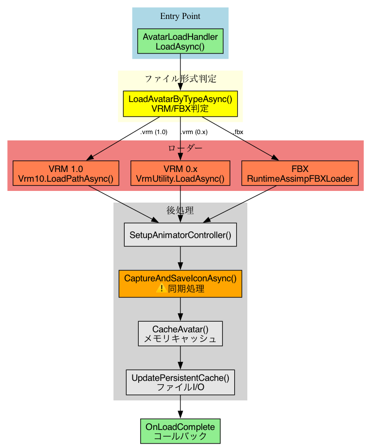
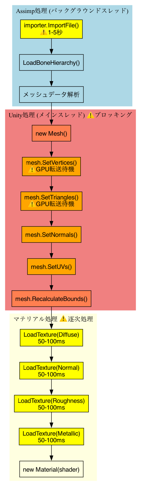
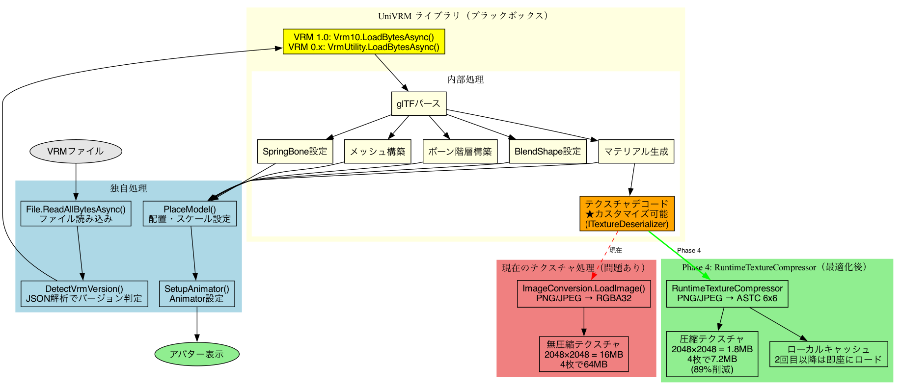
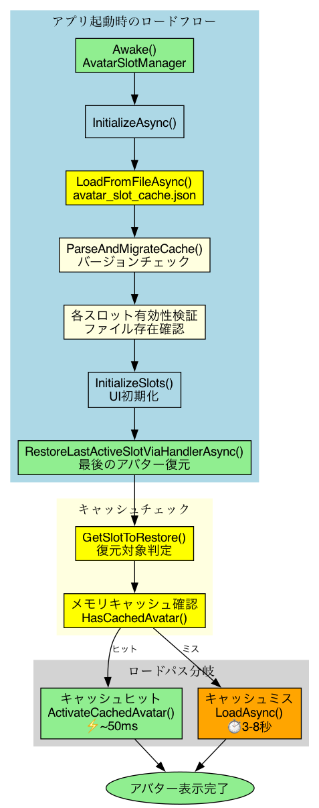
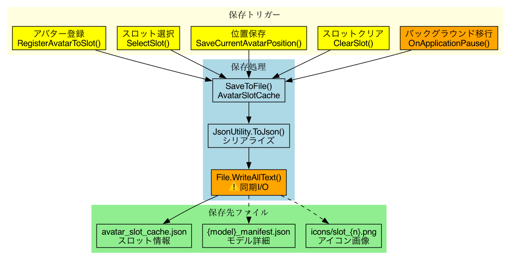
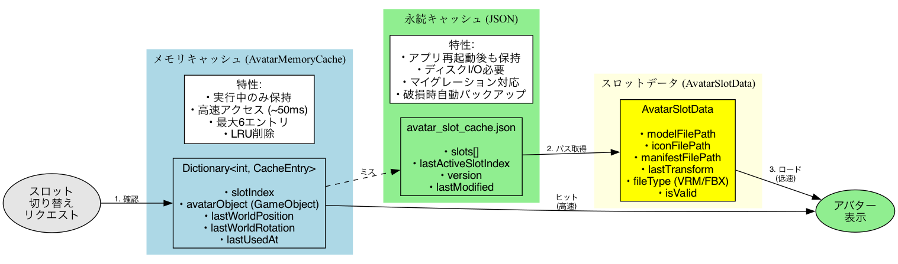
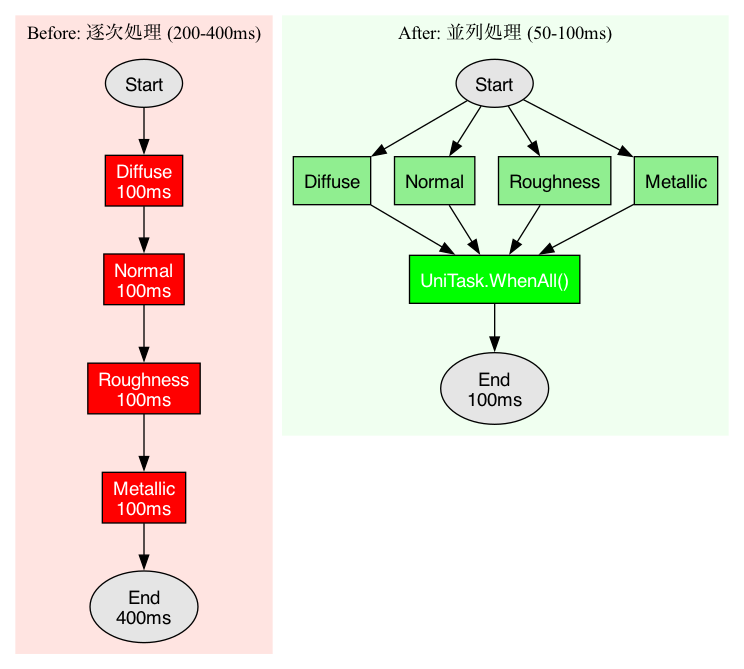
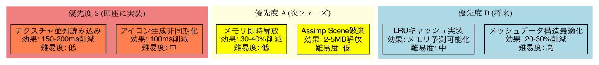
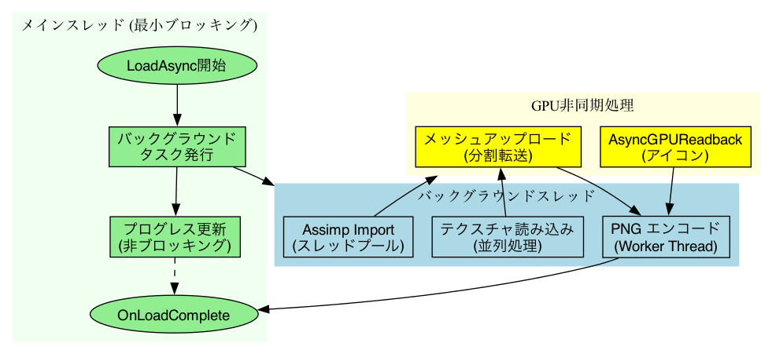

# アバターローダー最適化計画

## 1. 現在のワークフロー

### 1.1 全体フロー図



**処理フロー:**
1. `AvatarLoadHandler.LoadAsync()` がエントリポイント
2. ファイル形式（VRM 1.0 / VRM 0.x / FBX）を判定
3. 対応するローダーで読み込み
4. 後処理（アニメーター設定、アイコン生成、キャッシュ）

### 1.2 FBXローダー詳細フロー



**ボトルネック箇所:**
- `importer.ImportFile()`: 1-5秒（ファイルサイズ依存）
- `mesh.SetVertices()` 等: GPU転送待機
- テクスチャ読み込み: 逐次処理で200-400ms

### 1.3 VRMローダー詳細フロー



**VRMロードは完全にUniVRMライブラリに依存:**

```
RuntimeFBXLoaderBridge
    ↓
File.ReadAllBytesAsync() ← 独自処理
    ↓
DetectVrmVersion() ← 独自処理（JSONパース）
    ↓
┌─────────────────────────────────────────┐
│  UniVRM ライブラリ（ブラックボックス）      │
│                                          │
│  VRM 1.0: Vrm10.LoadBytesAsync()        │
│  VRM 0.x: VrmUtility.LoadBytesAsync()   │
│                                          │
│  内部処理:                               │
│  - glTFパース                            │
│  - メッシュ構築                          │
│  - マテリアル生成                        │
│  - テクスチャデコード ← ★カスタマイズ可能  │
│  - ボーン階層構築                        │
│  - BlendShape設定                        │
│  - SpringBone設定                        │
└─────────────────────────────────────────┘
    ↓
PlaceModel() / SetupAnimator() ← 独自処理
```

**独自処理とUniVRM処理の分担:**

| 処理 | 担当 | カスタマイズ |
|------|------|-------------|
| ファイル読み込み | 独自 (`File.ReadAllBytesAsync`) | ○ |
| VRMバージョン検出 | 独自 (JSONパース) | ○ |
| glTFパース | UniVRM | ✕ |
| メッシュ構築 | UniVRM | ✕ |
| マテリアル生成 | UniVRM (`materialGeneratorCallback`) | △ |
| **テクスチャデコード** | UniVRM (`textureDeserializer`) | **○** |
| ボーン階層構築 | UniVRM | ✕ |
| 配置・Animator設定 | 独自 | ○ |

**現在のテクスチャデシリアライザ設定:**
```csharp
// すべての箇所で null（UniVRMデフォルト）を使用
currentGltfInstance = await VrmUtility.LoadBytesAsync(
    path: fileName,
    bytes: bytes,
    awaitCaller: new RuntimeOnlyAwaitCaller(),
    materialGeneratorCallback: null,
    metaCallback: null,
    textureDeserializer: null,  // ← ここがカスタマイズポイント
    loadAnimation: false,
    springboneRuntime: null
);
```

**UniVRMデフォルトのテクスチャ処理:**
1. glTFバイナリ内のPNG/JPEGデータを抽出
2. `ImageConversion.LoadImage()` でデコード
3. **無圧縮 RGBA32 形式** でTexture2D生成
4. マテリアルに割り当て

**問題点:**
- テクスチャは無圧縮のRGBA32（32bit/pixel）でロードされる
- 2048x2048テクスチャ1枚 = 16MB
- 一般的なVRMアバター（テクスチャ4-8枚）= 64-128MB
- 低メモリ端末でクラッシュのリスク

### 1.4 永続化ファイル（JSON）のロードフロー



**アプリ起動時のロードフロー:**
1. `AvatarSlotManager.Awake()` → `InitializeAsync()`
2. `LoadFromFileAsync()` で `avatar_slot_cache.json` を非同期読み込み
3. `ParseAndMigrateCache()` でバージョンチェック・マイグレーション
4. 各スロットの有効性検証（ファイル存在確認）
5. UI初期化後、`RestoreLastActiveSlotViaHandlerAsync()` で最後のアバター復元
6. メモリキャッシュ確認 → ヒット時は高速復元（~50ms）、ミス時はフルロード

### 1.4 保存フロー



**保存トリガー:**
| タイミング | メソッド |
|-----------|---------|
| アバター登録完了 | `RegisterAvatarToSlot()` |
| スロット選択 | `SelectSlot()` |
| 位置保存 | `SaveCurrentAvatarPosition()` |
| スロットクリア | `ClearSlot()` |
| バックグラウンド移行 | `OnApplicationPause()` |

**保存先ファイル:**
```
{persistentDataPath}/AvatarSlots/
├── avatar_slot_cache.json    # スロット情報
├── icons/
│   ├── slot_0.png           # スロット0アイコン
│   ├── slot_1.png           # スロット1アイコン
│   └── ...
└── {model}_manifest.json     # モデル詳細（モデルと同じ場所）
```

### 1.5 二層キャッシュ構造



| レイヤー | 保持位置 | 永続性 | アクセス速度 |
|---------|--------|--------|-------------|
| **メモリキャッシュ** | `AvatarMemoryCache` | 実行中のみ | ~50ms |
| **永続キャッシュ** | JSON (persistentDataPath) | 再起動後も保持 | 3-8秒 |

**JSON構造 (avatar_slot_cache.json):**
```json
{
  "slots": [
    {
      "slotIndex": 0,
      "avatarName": "Avatar Name",
      "modelFilePath": "/path/to/avatar.vrm",
      "iconFilePath": "...icons/slot_0.png",
      "fileType": "VRM",
      "isValid": true,
      "lastTransform": {
        "posX": 0.0, "posY": 0.0, "posZ": 0.0,
        "rotX": 0.0, "rotY": 0.0, "rotZ": 0.0, "rotW": 1.0,
        "hasData": true
      }
    }
  ],
  "maxSlots": 6,
  "version": 2,
  "lastActiveSlotIndex": 0,
  "lastModified": "2024-12-20 14:30:45"
}
```

**永続化関連の最適化ポイント:**
- `File.WriteAllText()` は同期I/O → `WriteAllTextAsync()` に変更可能
- JSON読み込み時のファイル存在チェックが複数回実行されている
- マイグレーション処理は初回起動時のみだが、毎回バージョンチェックが走る

---

## 2. 問題点の可視化

### 2.1 メインスレッドブロッキング

| 処理 | 時間 | 影響度 |
|------|------|--------|
| SetVertices/Triangles | 100-500ms | 高 |
| LoadImage(texture) × 4 | 200-400ms | 高 |
| ReadPixels() | 20-50ms | 中 |
| EncodeToPNG() | 30-50ms | 中 |
| **合計** | **500-1000ms** | フレームレート低下 |

### 2.2 メモリ使用量の問題

**100K頂点アバターの場合:**

| データ | サイズ |
|--------|--------|
| List\<Vector3\> verts | 1.2 MB |
| List\<int\> tris | 1.2 MB |
| List\<Vector3\> norms | 1.2 MB |
| Unity Mesh内部 | 3.6 MB |
| Assimp Scene | 2-5 MB |
| **ピークメモリ** | **10-12 MB** |
| **理想値** | **4-5 MB** |

**問題:** 一時データがGCされるまでメモリに残存

---

## 3. 最適化案

### 3.1 テクスチャ読み込みの並列化



**実装方法:**
```csharp
// Before: 逐次処理 (400ms)
var diffuse = await LoadTextureFromFile(diffusePath);
var normal = await LoadTextureFromFile(normalPath);
var roughness = await LoadTextureFromFile(roughnessPath);
var metallic = await LoadTextureFromFile(metallicPath);

// After: 並列処理 (100ms)
var (diffuse, normal, roughness, metallic) = await UniTask.WhenAll(
    LoadTextureFromFile(diffusePath),
    LoadTextureFromFile(normalPath),
    LoadTextureFromFile(roughnessPath),
    LoadTextureFromFile(metallicPath)
);
```

**期待効果:** 150-200ms削減

### 3.2 アイコン生成の非同期化

**Before:**
```csharp
// 同期処理（メインスレッドブロック）
texture.ReadPixels(rect, 0, 0);  // GPU待機 20-50ms
byte[] png = texture.EncodeToPNG();  // CPU処理 30-50ms
File.WriteAllBytes(path, png);
```

**After:**
```csharp
// 非同期処理
var request = AsyncGPUReadback.Request(renderTexture);
await request;  // 他の処理が可能

// Worker Threadでエンコード
byte[] png = await UniTask.RunOnThreadPool(() =>
    ImageConversion.EncodeArrayToPNG(request.GetData<byte>().ToArray(), ...));

await File.WriteAllBytesAsync(path, png);
```

**期待効果:** 100ms削減、メインスレッドブロック解消

### 3.3 メモリ最適化

**Before:**
```csharp
var verts = new List<Vector3>();
// ... 頂点データ追加 ...
mesh.SetVertices(verts);
// verts はまだメモリに残存
```

**After:**
```csharp
var verts = new List<Vector3>();
// ... 頂点データ追加 ...
mesh.SetVertices(verts);
verts.Clear();
verts.TrimExcess();  // メモリ即時解放
```

**期待効果:** ピークメモリ30-40%削減

---

## 4. 実装優先度



### 優先度 S（即座に実装）
| 項目 | 効果 | 難易度 |
|------|------|--------|
| テクスチャ並列読み込み | 150-200ms削減 | 低 |
| アイコン生成非同期化 | 100ms削減 | 中 |

### 優先度 A（次フェーズ）
| 項目 | 効果 | 難易度 |
|------|------|--------|
| メモリ即時解放 | 30-40%削減 | 低 |
| Assimp Scene破棄 | 2-5MB解放 | 低 |

### 優先度 B（将来）
| 項目 | 効果 | 難易度 |
|------|------|--------|
| LRUキャッシュ実装 | メモリ予測可能化 | 中 |
| メッシュデータ構造最適化 | 20-30%削減 | 高 |

---

## 5. 最適化後の目標フロー



**設計方針:**
- メインスレッドは進捗更新とコールバックのみ
- 重い処理はバックグラウンドスレッドへ
- GPU処理は非同期リクエスト

---

## 6. 期待される改善効果

| 項目 | 現在 | 最適化後 | 削減率 |
|------|------|---------|--------|
| テクスチャ読み込み | 200-400ms | 50-100ms | **75%** |
| アイコン生成 | 50-150ms | 10-30ms | **80%** |
| ピークメモリ | 10-12MB | 5-6MB | **50%** |
| メインスレッドブロック | 500-1000ms | 100-200ms | **80%** |
| 総ロード時間 | 3-8秒 | 2-4秒 | **50%** |

---

## 7. 実装計画

### Phase 1: 即効性のある最適化
- [ ] テクスチャ並列読み込み (`UniTask.WhenAll`)
- [ ] 一時リストの即時解放 (`Clear` + `TrimExcess`)

### Phase 2: 非同期化
- [ ] `AsyncGPUReadback` によるアイコン生成
- [ ] PNG エンコードの Worker Thread 化

### Phase 3: アーキテクチャ改善
- [ ] Assimp Scene のライフサイクル管理
- [ ] LRU マテリアルキャッシュ
- [ ] メッシュデータ構造の最適化

### Phase 4: RuntimeTextureCompressor 導入（VRM テクスチャ圧縮）

> **優先度: 高** - VRMが主体の現状で最も効果的なメモリ最適化

**概要:**
`ITextureDeserializer` をカスタム実装し、RuntimeTextureCompressor を使用してテクスチャをASTC/ETC2形式で圧縮する。

**RuntimeTextureCompressor ライブラリ:**
- リポジトリ: `dsgaragejp/RuntimeTextureCompressor` (プライベート)
- 機能: ランタイムでのGPU圧縮テクスチャ生成
- 依存: UniTask（既にインストール済み）

**対応フォーマット:**

| 入力 | 出力 |
|------|------|
| PNG, JPEG, WebP, AVIF, GIF, BMP, PSD, TGA, HDR | ASTC 4x4〜12x12, ETC2, BC1/3/6H/7 |

**プラットフォーム別出力:**

| プラットフォーム | 推奨フォーマット |
|-----------------|-----------------|
| iOS | ASTC 6x6 |
| Android | ASTC 6x6 / ETC2 |
| Windows | BC7 / BC3 |
| Mac (Apple Silicon) | ASTC 6x6 |

**期待されるメモリ削減効果:**

| テクスチャ | RGBA32 (現在) | ASTC 6x6 | 削減率 |
|-----------|--------------|----------|--------|
| 2048x2048 × 1枚 | 16 MB | 1.8 MB | **89%** |
| 1024x1024 × 1枚 | 4 MB | 0.45 MB | **89%** |
| 一般的VRM (4枚) | 40 MB | 4.5 MB | **89%** |
| 高品質VRM (8枚) | 80 MB | 9 MB | **89%** |

**実装ステップ:**

- [ ] **Step 1: パッケージ導入**
  ```
  // manifest.json に追加
  "com.dsgarage.runtime-texture-compressor":
    "https://github.com/dsgaragejp/RuntimeTextureCompressor.git?path=Unity/Packages/RuntimeTextureCompressor"
  ```

- [ ] **Step 2: カスタムテクスチャデシリアライザ作成**
  ```csharp
  // Assets/Scripts/FBXLoader/Texture/CompressedTextureDeserializer.cs
  public class CompressedTextureDeserializer : ITextureDeserializer
  {
      private readonly TextureLoader _loader;

      public CompressedTextureDeserializer()
      {
          // プラットフォーム自動判定、キャッシュ有効期限1日
          _loader = TextureLoader.CreateAutoFormatAutoCache();
      }

      public async Task<Texture2D> LoadTextureAsync(
          DeserializingTextureInfo textureInfo,
          IAwaitCaller awaitCaller)
      {
          // glTF内のテクスチャバイナリを一時ファイルに書き出し
          string tempPath = Path.Combine(
              Application.temporaryCachePath,
              $"vrm_tex_{Guid.NewGuid()}.png");

          await File.WriteAllBytesAsync(tempPath, textureInfo.ImageData);

          try
          {
              // RuntimeTextureCompressor で圧縮ロード
              var result = await _loader.LoadURI(new Uri($"file://{tempPath}"));

              if (result.Error != TextureLoaderError.None)
              {
                  Debug.LogWarning($"Compressed load failed, fallback to default");
                  return await DefaultLoad(textureInfo);
              }

              return result.texture;
          }
          finally
          {
              // 一時ファイル削除
              if (File.Exists(tempPath))
                  File.Delete(tempPath);
          }
      }
  }
  ```

- [ ] **Step 3: RuntimeFBXLoaderBridge 修正**
  ```csharp
  // VRM 0.x ロード時
  private static readonly CompressedTextureDeserializer _textureDeserializer
      = new CompressedTextureDeserializer();

  currentGltfInstance = await VrmUtility.LoadBytesAsync(
      path: fileName,
      bytes: bytes,
      awaitCaller: new RuntimeOnlyAwaitCaller(),
      materialGeneratorCallback: null,
      metaCallback: null,
      textureDeserializer: _textureDeserializer,  // ← 変更
      loadAnimation: false,
      springboneRuntime: null
  );
  ```

- [ ] **Step 4: VRM 1.0 対応**
  - `Vrm10.LoadBytesAsync` でのテクスチャデシリアライザ設定を調査
  - 同様のカスタムデシリアライザを適用

- [ ] **Step 5: 設定UI追加（オプション）**
  - 圧縮品質選択（ASTC 4x4 高品質 / 6x6 バランス / 8x8 省メモリ）
  - 圧縮有効/無効切り替え

**アーキテクチャ図:**

```
VRMファイル (glTF 2.0)
    ↓
UniVRM (glTFパース)
    ↓
ITextureDeserializer.LoadTextureAsync()
    ↓
CompressedTextureDeserializer
    ↓
┌─────────────────────────────────────────┐
│  RuntimeTextureCompressor               │
│                                          │
│  1. PNG/JPEG バイナリ受け取り            │
│  2. stb_image でデコード（バックグラウンド）│
│  3. ASTC/ETC2 エンコード（マルチスレッド） │
│  4. ローカルキャッシュ保存               │
│  5. 圧縮済み Texture2D 返却              │
└─────────────────────────────────────────┘
    ↓
圧縮済み Texture2D (ASTC 6x6)
    ↓
マテリアルに割り当て
```

**キャッシュの恩恵:**
- 初回ロード: 圧縮処理込みで若干遅くなる可能性あり
- 2回目以降: キャッシュから即座に圧縮済みテクスチャをロード（高速化）
- キャッシュ場所: `{persistentDataPath}/RuntimeTextureCompressor/`

**リスクと対策:**

| リスク | 対策 |
|--------|------|
| ASTC非対応デバイス | ETC2へフォールバック |
| 圧縮による画質劣化 | ASTC 4x4（高品質）オプション提供 |
| 初回ロード時間増加 | プログレス表示、バックグラウンド処理 |
| キャッシュ肥大化 | 有効期限設定（デフォルト1日） |

### 将来検討: FBX Asset バイナリキャッシュ

> **注記:** 現在はVRMが主体のため優先度は低い。FBXアバターがメインになった場合に検討。

**概要:**
FBXファイルから生成されたMesh/Material/Textureをバイナリ形式でキャッシュし、2回目以降のロードを高速化する。

**キャッシュ構造案:**
```
{persistentDataPath}/AvatarCache/{avatarHash}/
├── meshes.cache      # シリアライズ済みメッシュデータ
├── materials.json    # マテリアルメタデータ
├── manifest.json     # インデックス＋バージョン情報
└── textures/         # キャッシュ済みテクスチャ
```

**シリアライズ対象:**
```csharp
[Serializable]
public class SerializedMeshData
{
    public Vector3[] vertices;
    public int[] triangles;
    public Vector3[] normals;
    public Vector2[] uvs;
    public BoneWeight[] boneWeights;
    public Matrix4x4[] bindposes;
    public BlendShapeData[] blendShapes;
    public float version;
}
```

**期待効果:**
| ロードタイプ | 時間 | 備考 |
|-------------|------|------|
| 初回ロード（FBX） | 3-5秒 | Assimpフルパース |
| キャッシュ復元 | 0.8-1.2秒 | **60-70%短縮** |
| メモリキャッシュ | ~50ms | 即時 |

**容量見積もり:**
- アバター1体: 50MB（未圧縮）→ 15-20MB（圧縮後）
- 6スロット分: 約100-120MB

**VRMで不要な理由:**
- UniVRMライブラリが効率的にロード処理
- Assimpパースのボトルネックが存在しない
- VRM形式自体が最適化されている

---

## 8. 関連ファイル

### ロード処理
| ファイル | 役割 |
|----------|------|
| `AvatarLoadHandler.cs` | 統一ロードエントリポイント |
| `RuntimeFBXLoaderBridge.cs` | VRM/FBX判定・ロード制御 |
| `RuntimeAssimpFBXLoader.cs` | FBXパース・メッシュ構築 |
| `RuntimeFBXModelBuilder.cs` | メッシュ作成・アタッチ |
| `RuntimeMaterialManager.cs` | マテリアル・テクスチャ管理 |
| `AvatarIconCapture.cs` | アイコン生成 |

### 永続化・キャッシュ
| ファイル | 役割 |
|----------|------|
| `AvatarSlotManager.cs` | スロット管理・起動時復元 |
| `AvatarSlotData.cs` | スロットデータ構造・JSON保存/読み込み |
| `AvatarMemoryCache.cs` | メモリキャッシュ管理（実行中） |
| `AvatarManifest.cs` | モデルマニフェスト管理 |
