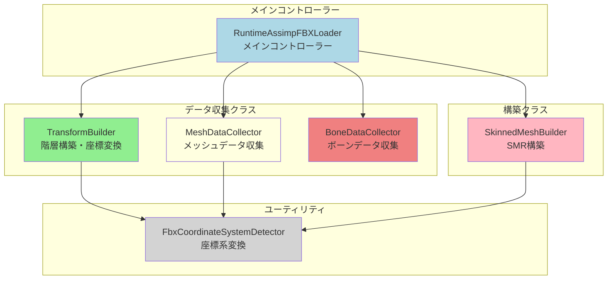
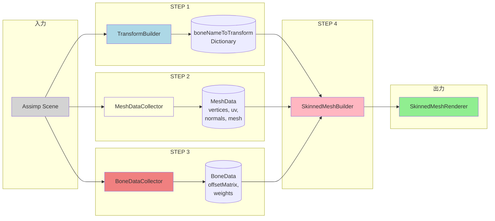
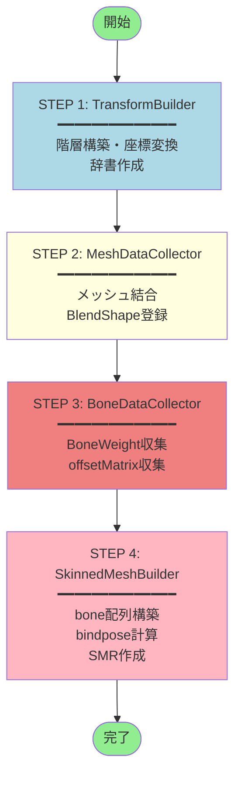

# RuntimeAssimpFBXLoader - SkinnedMeshRenderer リファクタリング設計書

## 📋 目次

- [概要](#概要)
- [目標](#目標)
- [設計原則](#設計原則)
- [クラス構造](#クラス構造)
- [データフロー](#データフロー)
- [処理順序](#処理順序)
- [実装詳細](#実装詳細)
- [制約事項](#制約事項)
- [期待される結果](#期待される結果)

## 📊 図解

**詳細な図は [diagrams.md](./diagrams.md) を参照してください。**

以下の図が含まれています：
- クラス構造図（Mermaid）
- データフロー図（Mermaid）
- 処理順序図（Mermaid）
- データ構造詳細
- 座標変換適用箇所
- 問題と解決策のマッピング
- 実装フェーズ（ガントチャート）

---

## 概要

Assimp でロードした FBX を Unity Runtime で正しくスキニング再構築するための大規模リファクタリング。

### 現在の問題点

- ❌ 足の逆関節
- ❌ 膝のカクつき
- ❌ 衣装（Loungewear_saneko, Outer, Underwear）の破綻
- ❌ マルチメッシュでのボーン欠落
- ❌ 座標変換の二重適用
- ❌ データフローが不明確

---

## 目標

1. ✅ Assimp FBX を Unity Runtime で正しくスキニング再構築
2. ✅ 全てのスキン不具合を修正
3. ✅ クラス責務を分割し、バグ源を特定しやすくする
4. ✅ Transform → Mesh → Bone → SMR の理想的な順序で処理
5. ✅ BlendShape、BoneWeight、BindPose を正しい順番で適用
6. ✅ coordinateConversionMatrix を正しく全ステップに適用

---

## 設計原則

### 🎯 最重要原則

> **「スキニング問題の80%は Transform の破綻が原因」**
>
> → TransformBuilder が最重要クラス

### 📐 その他の原則

1. **BoneDataCollector は Transform に依存しない**
   - Assimp 生データのみ扱う
   - Transform は TransformBuilder の責務

2. **SkinnedMeshBuilder で全データを合成**
   - Transform・Mesh・Bone の全データを統合

3. **変換ロジックは一箇所のみに集約**
   - 座標系変換の二重適用を防ぐ
   - offsetMatrix は raw のまま保持

4. **BlendShape は sharedMesh 設定前に追加**
   - Unity の仕様による制約

---

## クラス構造



### クラス一覧

| クラス名 | 責務 | 入力 | 出力 |
|---------|------|------|------|
| **TransformBuilder** | Assimp Node → Unity Transform 構築 | Assimp.Node, Scene | Transform, Dictionary<string, Transform> |
| **MeshDataCollector** | マルチメッシュを Unity Mesh に統合 | Assimp.Node, Scene | MeshData |
| **BoneDataCollector** | Bone 情報収集（offsetMatrix, BoneWeight） | Assimp.Node, Scene | BoneData |
| **SkinnedMeshBuilder** | SkinnedMeshRenderer 構築 | MeshData, BoneData, Transform | SkinnedMeshRenderer |

---

## データフロー



### データ構造

#### MeshData

```csharp
public struct MeshData
{
    public List<Vector3> vertices;      // 結合された頂点（座標変換済み）
    public List<Vector2> uvs;           // 結合されたUV
    public List<Vector3> normals;       // 結合された法線（座標変換済み）
    public List<int> triangles;         // 結合された三角形
    public UnityEngine.Mesh unityMesh;  // 作成されたMesh（BlendShape含む）
}
```

#### BoneData

```csharp
public struct BoneData
{
    public Dictionary<string, Assimp.Matrix4x4> boneNameToOffsetMatrix;  // ボーン名→OffsetMatrix（生データ）
    public Dictionary<string, int> boneNameToIndex;                      // ボーン名→グローバルインデックス
    public BoneWeight[] boneWeights;                                     // 全頂点のBoneWeight（正規化済み）
}
```

---

## 処理順序



### 各ステップの詳細

#### STEP 1: TransformBuilder

**入力:**
- `Assimp.Node rootNode`
- `Assimp.Scene scene`
- `Matrix4x4 coordinateConversionMatrix`

**処理:**
1. Assimp Node 階層を再帰的に走査
2. 各 Node に対して GameObject と Transform を作成
3. `SetTransformFromAssimpMatrix()` で座標変換を適用
   ```csharp
   m.Decompose(out var s, out var r, out var p);
   t.localPosition = ConvertVector(p, conv);
   t.localRotation = ConvertQuaternion(r, conv);
   t.localScale = new Vector3(s.X, s.Y, s.Z);
   ```
4. `boneNameToTransform` 辞書に登録

**出力:**
- `Transform rootTransform`
- `Dictionary<string, Transform> boneNameToTransform`

**重要:**
- この段階で Transform が正しくないと全てが破綻する
- coordinateConversionMatrix を必ず適用

---

#### STEP 2: MeshDataCollector

**入力:**
- `Assimp.Node node`
- `Assimp.Scene scene`
- `Matrix4x4 coordinateConversionMatrix`

**処理:**
1. Node の全メッシュから頂点・UV・法線・三角形を収集
2. **頂点と法線に coordinateConversionMatrix を適用**
3. Unity Mesh オブジェクトを作成
4. BlendShape を追加（sharedMesh 設定前に必須）
5. RecalculateBounds()

**出力:**
- `MeshData` 構造体

**重要:**
- Mesh.Combine は使わない（Assimp は独立メッシュを返す）
- BlendShape は必ずこの段階で追加

---

#### STEP 3: BoneDataCollector

**入力:**
- `Assimp.Node node`
- `Assimp.Scene scene`

**処理:**
1. 全メッシュから全ユニークボーン名を収集
2. ボーン名→グローバルインデックスのマッピング作成
3. ボーン名→OffsetMatrix（**生データ**）のマッピング作成
4. 全メッシュから BoneWeight を収集
5. BoneWeight を正規化（合計 = 1.0）

**出力:**
- `BoneData` 構造体

**重要:**
- Transform は扱わない（生データのみ）
- offsetMatrix は raw のまま保持（座標変換は STEP 4 で行う）
- マルチメッシュ対応（全メッシュからボーンを収集）

---

#### STEP 4: SkinnedMeshBuilder

**入力:**
- `MeshData meshData`
- `BoneData boneData`
- `Dictionary<string, Transform> boneNameToTransform`
- `Transform nodeTransform`
- `Transform rootBone`
- `Matrix4x4 coordinateConversionMatrix`

**処理:**

1. **Bone 配列構築**
   ```csharp
   Transform[] bones = new Transform[boneData.boneNameToIndex.Count];
   foreach (var kv in boneData.boneNameToIndex)
   {
       bones[kv.Value] = boneNameToTransform[kv.Key];
   }
   ```

2. **BindPose 計算**（座標変換適用）
   ```csharp
   foreach (var kv in boneData.boneNameToOffsetMatrix)
   {
       Matrix4x4 bindpose = conv * offsetMatrix * conv.inverse;
       bindposes[index] = bindpose;
   }
   ```

3. **SkinnedMeshRenderer 作成**（正しい順序）
   ```csharp
   smr.bones = bones;              // 1. bones
   smr.sharedMesh = mesh;          // 2. mesh (bindposes, boneWeights含む)
   smr.rootBone = rootBone;        // 3. rootBone
   smr.sharedMaterial = material;  // 4. material
   smr.updateWhenOffscreen = true; // 5. オフスクリーン更新
   ```

4. **検証**
   - bones.Length == bindposes.Length
   - boneWeights.Length == mesh.vertexCount
   - BlendShape が正しく反映されているか

**出力:**
- `SkinnedMeshRenderer`（完全に設定済み）

**重要:**
- ここで初めて offsetMatrix に座標変換を適用
- 設定順序を厳守

---

## 実装詳細

### TransformBuilder

```csharp
public class TransformBuilder
{
    private Matrix4x4 coordinateConversionMatrix;
    private Dictionary<string, Transform> boneNameToTransform;

    public TransformBuilder(Matrix4x4 conversionMatrix)
    {
        this.coordinateConversionMatrix = conversionMatrix;
        this.boneNameToTransform = new Dictionary<string, Transform>();
    }

    public Transform Build(Assimp.Node rootNode, Assimp.Scene scene)
    {
        // 階層を再帰的に構築
        // SetTransformFromAssimpMatrix() で座標変換適用
        // boneNameToTransform 辞書に登録
    }

    public Dictionary<string, Transform> GetBoneNameToTransform()
    {
        return boneNameToTransform;
    }

    private void SetTransformFromAssimpMatrix(Transform t, Assimp.Matrix4x4 m)
    {
        m.Decompose(out var s, out var r, out var p);
        t.localPosition = ConvertVector(p, coordinateConversionMatrix);
        t.localRotation = ConvertQuaternion(r, coordinateConversionMatrix);
        t.localScale = new Vector3(s.X, s.Y, s.Z);
    }
}
```

---

### MeshDataCollector

```csharp
public class MeshDataCollector
{
    private Matrix4x4 coordinateConversionMatrix;

    public MeshDataCollector(Matrix4x4 conversionMatrix)
    {
        this.coordinateConversionMatrix = conversionMatrix;
    }

    public async UniTask<MeshData> CollectAsync(Assimp.Node node, Assimp.Scene scene)
    {
        MeshData data = new MeshData();

        // 全メッシュから頂点・UV・法線・三角形を収集
        // 頂点と法線に coordinateConversionMatrix を適用
        // Unity Mesh を作成
        // BlendShape を追加

        return data;
    }
}
```

---

### BoneDataCollector

```csharp
public class BoneDataCollector
{
    public BoneData Collect(Assimp.Node node, Assimp.Scene scene)
    {
        BoneData data = new BoneData();

        // 全メッシュから全ユニークボーン名を収集
        // ボーン名→インデックスマッピング作成
        // ボーン名→OffsetMatrix（生データ）マッピング作成
        // BoneWeight を収集・正規化

        return data;
    }
}
```

---

### SkinnedMeshBuilder

```csharp
public class SkinnedMeshBuilder
{
    private Matrix4x4 coordinateConversionMatrix;

    public SkinnedMeshBuilder(Matrix4x4 conversionMatrix)
    {
        this.coordinateConversionMatrix = conversionMatrix;
    }

    public SkinnedMeshRenderer Build(
        MeshData meshData,
        BoneData boneData,
        Dictionary<string, Transform> boneNameToTransform,
        Transform nodeTransform,
        Transform rootBone)
    {
        // 1. Bone 配列構築
        Transform[] bones = BuildBonesArray(boneData, boneNameToTransform);

        // 2. BindPose 計算（座標変換適用）
        Matrix4x4[] bindposes = BuildBindPoses(boneData, bones);

        // 3. SkinnedMeshRenderer 作成
        SkinnedMeshRenderer smr = CreateSkinnedMeshRenderer(
            nodeTransform, meshData, bones, bindposes, rootBone);

        // 4. 検証
        Validate(smr, meshData, boneData);

        return smr;
    }

    private Matrix4x4[] BuildBindPoses(BoneData boneData, Transform[] bones)
    {
        // bindpose = conv * offsetMatrix * conv.inverse
    }
}
```

---

### RuntimeAssimpFBXLoader（リファクタリング後）

```csharp
public class RuntimeAssimpFBXLoader
{
    private async UniTask LoadMeshesForNodeAsync(Node node, Transform nodeTransform)
    {
        // STEP 1: Transform構築（既に完了している想定）

        // STEP 2: メッシュデータ収集
        var meshCollector = new MeshDataCollector(coordinateConversionMatrix);
        MeshData meshData = await meshCollector.CollectAsync(node, currentScene);

        // STEP 3: ボーンデータ収集
        var boneCollector = new BoneDataCollector();
        BoneData boneData = boneCollector.Collect(node, currentScene);

        // STEP 4: SkinnedMeshRenderer構築
        var smrBuilder = new SkinnedMeshBuilder(coordinateConversionMatrix);
        SkinnedMeshRenderer smr = smrBuilder.Build(
            meshData,
            boneData,
            boneNameToTransform,
            nodeTransform,
            cachedRootBone);

        Debug.Log($"[LoadMeshesForNode] SUCCESS for node: {node.Name}");
    }
}
```

---

## 制約事項

### ⚠️ 必須制約

1. **coordinateConversionMatrix の適用箇所**
   - ✅ TransformBuilder: localPosition, localRotation
   - ✅ MeshDataCollector: vertices, normals
   - ✅ SkinnedMeshBuilder: bindpose
   - ❌ BoneDataCollector: offsetMatrix は生データのまま

2. **座標変換の二重適用は絶対に禁止**
   - offsetMatrix に直接適用してはいけない
   - SkinnedMeshBuilder で一度だけ適用

3. **BlendShape のタイミング**
   - 必ず sharedMesh を設定する前に追加

4. **BoneWeight の扱い**
   - float で保持し、tiny weight を丸めない
   - 4つのスロットを優先（weight != 0）
   - 合計が 1.0 になるように正規化

5. **SkinnedMeshRenderer の設定順序**
   1. smr.bones
   2. smr.sharedMesh
   3. smr.rootBone
   4. smr.sharedMaterial
   5. smr.updateWhenOffscreen

---

## 期待される結果

### ✅ 修正される問題

- ✅ Aポーズの破綻が完全に解消される
- ✅ 足の逆関節が解消される
- ✅ 膝のカクつきが解消される
- ✅ Loungewear_saneko の破綻がなくなる
- ✅ Outer（コート）の破綻がなくなる
- ✅ Underwear の伸びがなくなる
- ✅ マルチメッシュの衣装が正しくスキニングされる
- ✅ Weight loss（重みの欠損）がなくなる
- ✅ rootBone = Hips のとき、正しいBindPoseが構築される

### 📊 検証項目

1. **Transform 階層**
   - Hips の位置・回転が正しいか
   - 各ボーンの Transform が正しいか

2. **Mesh**
   - 頂点数が正しいか
   - BlendShape が正しく追加されているか

3. **SkinnedMeshRenderer**
   - bones.Length == bindposes.Length
   - boneWeights.Length == mesh.vertexCount
   - rootBone が Hips に設定されているか

4. **実行時**
   - メッシュが破綻していないか
   - アニメーション再生時に正しく動くか

---

## 成果物

1. ✅ **データ構造**
   - `MeshData.cs`
   - `BoneData.cs`

2. ✅ **クラス実装**
   - `TransformBuilder.cs`
   - `MeshDataCollector.cs`
   - `BoneDataCollector.cs`
   - `SkinnedMeshBuilder.cs`

3. ✅ **リファクタリング**
   - `RuntimeAssimpFBXLoader.cs` の簡素化

4. ✅ **ドキュメント**
   - 設計書（本ドキュメント）
   - クラス図
   - データフロー図
   - 処理順序図

---

## 参考資料

### Unity SkinnedMeshRenderer 公式ドキュメント

- [SkinnedMeshRenderer](https://docs.unity3d.com/ScriptReference/SkinnedMeshRenderer.html)
- [Mesh.bindposes](https://docs.unity3d.com/ScriptReference/Mesh-bindposes.html)
- [Mesh.boneWeights](https://docs.unity3d.com/ScriptReference/Mesh-boneWeights.html)
- [Mesh.AddBlendShapeFrame](https://docs.unity3d.com/ScriptReference/Mesh.AddBlendShapeFrame.html)

### Assimp ドキュメント

- [Assimp Documentation](http://assimp.sourceforge.net/lib_html/index.html)

---

## 更新履歴

| 日付 | バージョン | 内容 |
|------|-----------|------|
| 2025-01-18 | 1.0.0 | 初版作成 |

---

**作成者:** Claude Code
**プロジェクト:** arCam/aiCam - Runtime FBX Loader
