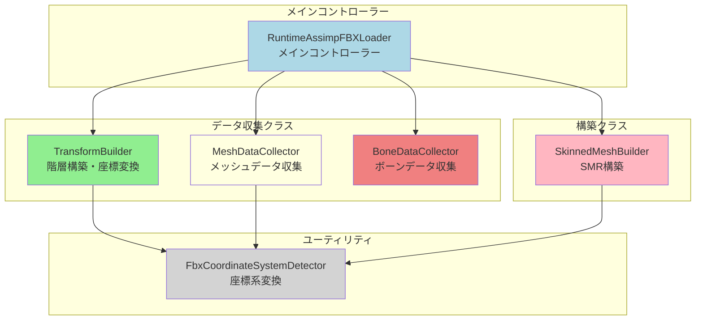
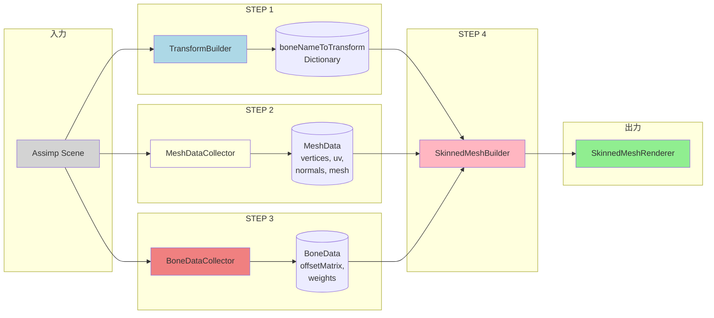
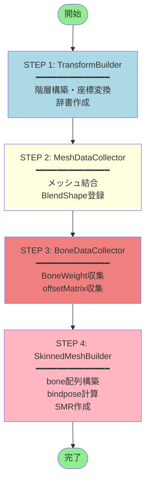
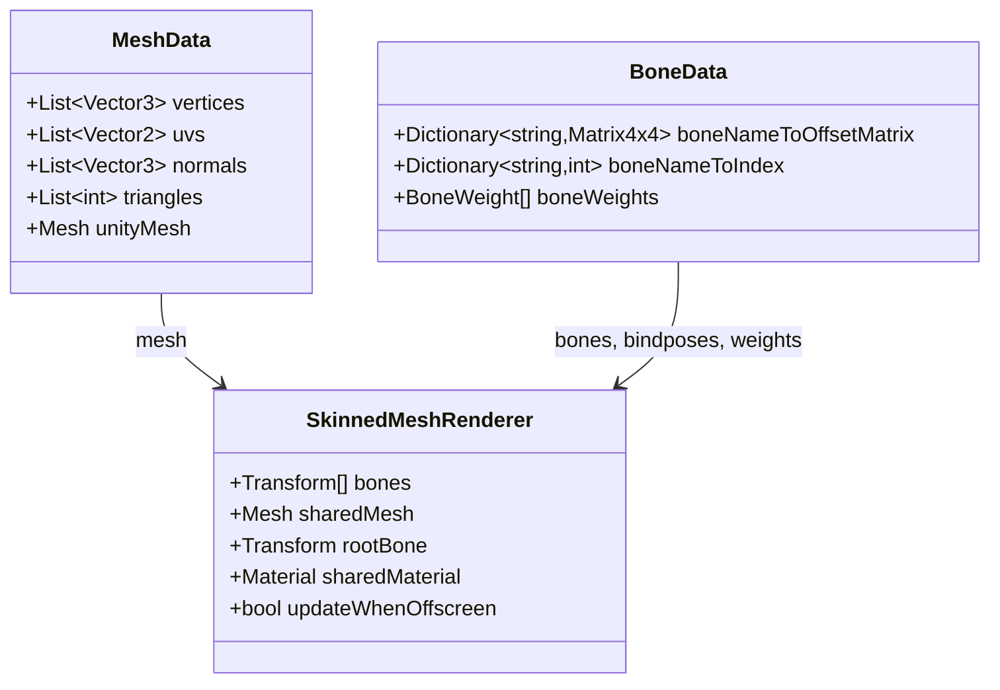
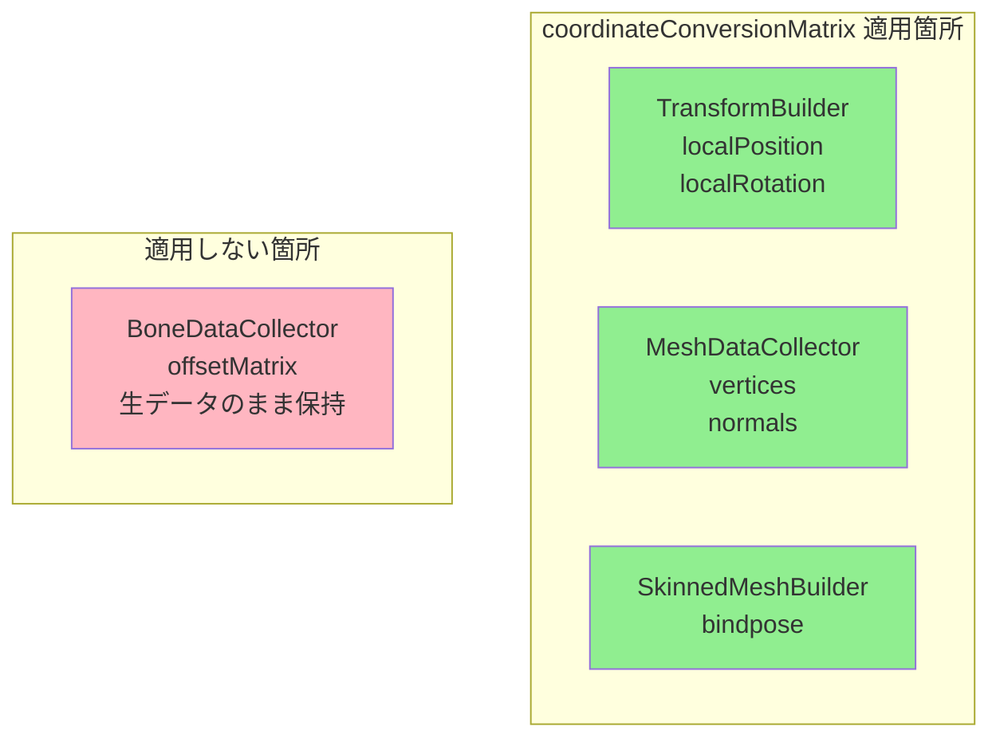
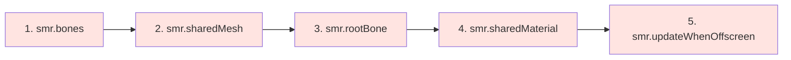
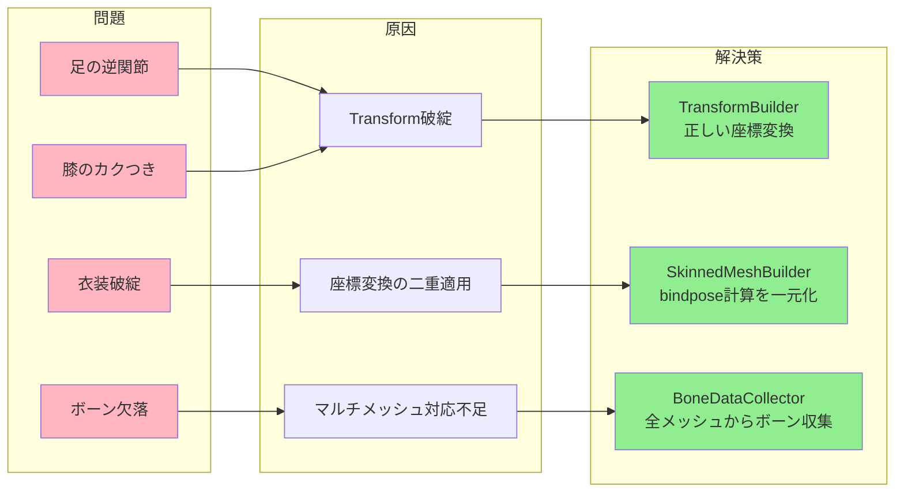
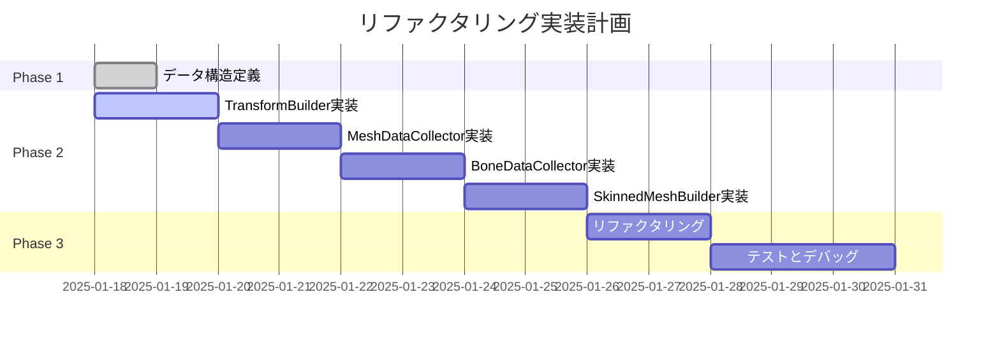

# SkinnedMeshRenderer リファクタリング - 図解

## クラス構造図

```mermaid
graph TB
    subgraph "メインコントローラー"
        RAFL[RuntimeAssimpFBXLoader<br/>メインコントローラー]
    end

    subgraph "データ収集クラス"
        TB[TransformBuilder<br/>階層構築・座標変換]
        MDC[MeshDataCollector<br/>メッシュデータ収集]
        BDC[BoneDataCollector<br/>ボーンデータ収集]
    end

    subgraph "構築クラス"
        SMB[SkinnedMeshBuilder<br/>SMR構築]
    end

    subgraph "ユーティリティ"
        FCSD[FbxCoordinateSystemDetector<br/>座標系変換]
    end

    RAFL --> TB
    RAFL --> MDC
    RAFL --> BDC
    RAFL --> SMB

    TB --> FCSD
    MDC --> FCSD
    SMB --> FCSD

    style RAFL fill:#ADD8E6
    style TB fill:#90EE90
    style MDC fill:#FFFFE0
    style BDC fill:#F08080
    style SMB fill:#FFB6C1
    style FCSD fill:#D3D3D3
```

---

## データフロー図

```mermaid
graph LR
    subgraph "入力"
        AS[Assimp Scene]
    end

    subgraph "STEP 1"
        TB[TransformBuilder]
        BND[(boneNameToTransform<br/>Dictionary)]
    end

    subgraph "STEP 2"
        MDC[MeshDataCollector]
        MD[(MeshData<br/>vertices, uv,<br/>normals, mesh)]
    end

    subgraph "STEP 3"
        BDC[BoneDataCollector]
        BD[(BoneData<br/>offsetMatrix,<br/>weights)]
    end

    subgraph "STEP 4"
        SMB[SkinnedMeshBuilder]
    end

    subgraph "出力"
        SMR[SkinnedMeshRenderer]
    end

    AS --> TB
    TB --> BND

    AS --> MDC
    MDC --> MD

    AS --> BDC
    BDC --> BD

    BND --> SMB
    MD --> SMB
    BD --> SMB
    SMB --> SMR

    style AS fill:#D3D3D3
    style TB fill:#ADD8E6
    style MDC fill:#FFFFE0
    style BDC fill:#F08080
    style SMB fill:#FFB6C1
    style SMR fill:#90EE90
```

---

## 処理順序図

```mermaid
graph TB
    Start([開始])

    Step1[STEP 1: TransformBuilder<br/>━━━━━━━━━━━━━━<br/>階層構築・座標変換<br/>辞書作成]

    Step2[STEP 2: MeshDataCollector<br/>━━━━━━━━━━━━━━<br/>メッシュ結合<br/>BlendShape登録]

    Step3[STEP 3: BoneDataCollector<br/>━━━━━━━━━━━━━━<br/>BoneWeight収集<br/>offsetMatrix収集]

    Step4[STEP 4: SkinnedMeshBuilder<br/>━━━━━━━━━━━━━━<br/>bone配列構築<br/>bindpose計算<br/>SMR作成]

    End([完了])

    Start --> Step1
    Step1 --> Step2
    Step2 --> Step3
    Step3 --> Step4
    Step4 --> End

    style Start fill:#90EE90
    style Step1 fill:#ADD8E6
    style Step2 fill:#FFFFE0
    style Step3 fill:#F08080
    style Step4 fill:#FFB6C1
    style End fill:#90EE90
```

---

## データ構造詳細

```mermaid
classDiagram
    class MeshData {
        +List~Vector3~ vertices
        +List~Vector2~ uvs
        +List~Vector3~ normals
        +List~int~ triangles
        +Mesh unityMesh
    }

    class BoneData {
        +Dictionary~string,Matrix4x4~ boneNameToOffsetMatrix
        +Dictionary~string,int~ boneNameToIndex
        +BoneWeight[] boneWeights
    }

    class SkinnedMeshRenderer {
        +Transform[] bones
        +Mesh sharedMesh
        +Transform rootBone
        +Material sharedMaterial
        +bool updateWhenOffscreen
    }

    MeshData --> SkinnedMeshRenderer : mesh
    BoneData --> SkinnedMeshRenderer : bones, bindposes, weights
```

---

## 座標変換の適用箇所

```mermaid
graph TB
    subgraph "coordinateConversionMatrix 適用箇所"
        T1[TransformBuilder<br/>localPosition<br/>localRotation]
        M1[MeshDataCollector<br/>vertices<br/>normals]
        S1[SkinnedMeshBuilder<br/>bindpose]
    end

    subgraph "適用しない箇所"
        B1[BoneDataCollector<br/>offsetMatrix<br/>生データのまま保持]
    end

    style T1 fill:#90EE90
    style M1 fill:#90EE90
    style S1 fill:#90EE90
    style B1 fill:#FFB6C1
```

---

## SkinnedMeshRenderer 設定順序

```mermaid
graph LR
    S1[1. smr.bones] --> S2[2. smr.sharedMesh]
    S2 --> S3[3. smr.rootBone]
    S3 --> S4[4. smr.sharedMaterial]
    S4 --> S5[5. smr.updateWhenOffscreen]

    style S1 fill:#FFE4E1
    style S2 fill:#FFE4E1
    style S3 fill:#FFE4E1
    style S4 fill:#FFE4E1
    style S5 fill:#FFE4E1
```

---

## 問題と解決策のマッピング

```mermaid
graph LR
    subgraph "問題"
        P1[足の逆関節]
        P2[膝のカクつき]
        P3[衣装破綻]
        P4[ボーン欠落]
    end

    subgraph "原因"
        C1[Transform破綻]
        C2[座標変換の二重適用]
        C3[マルチメッシュ対応不足]
    end

    subgraph "解決策"
        S1[TransformBuilder<br/>正しい座標変換]
        S2[SkinnedMeshBuilder<br/>bindpose計算を一元化]
        S3[BoneDataCollector<br/>全メッシュからボーン収集]
    end

    P1 --> C1
    P2 --> C1
    P3 --> C2
    P4 --> C3

    C1 --> S1
    C2 --> S2
    C3 --> S3

    style P1 fill:#FFB6C1
    style P2 fill:#FFB6C1
    style P3 fill:#FFB6C1
    style P4 fill:#FFB6C1
    style S1 fill:#90EE90
    style S2 fill:#90EE90
    style S3 fill:#90EE90
```

---

## 実装フェーズ

```mermaid
gantt
    title リファクタリング実装計画
    dateFormat YYYY-MM-DD
    section Phase 1
    データ構造定義           :done, p1, 2025-01-18, 1d
    section Phase 2
    TransformBuilder実装     :active, p2, 2025-01-18, 2d
    MeshDataCollector実装    :p3, after p2, 2d
    BoneDataCollector実装    :p4, after p3, 2d
    SkinnedMeshBuilder実装   :p5, after p4, 2d
    section Phase 3
    リファクタリング         :p6, after p5, 2d
    テストとデバッグ         :p7, after p6, 3d
```
