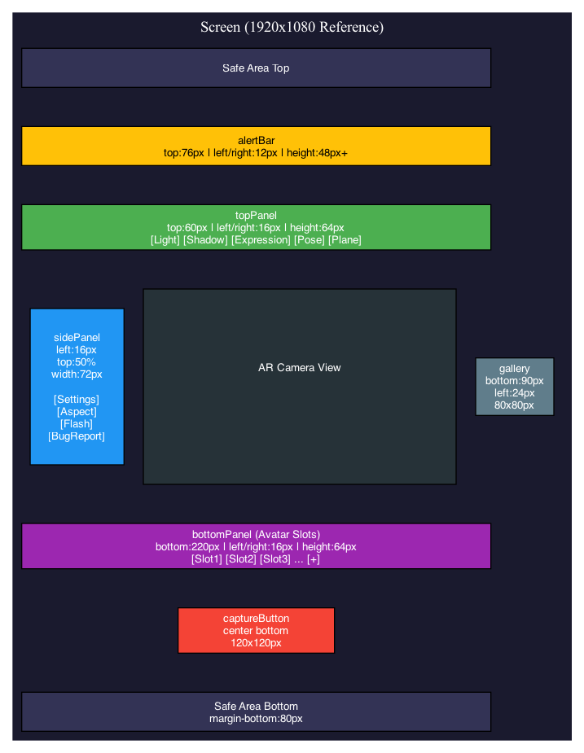
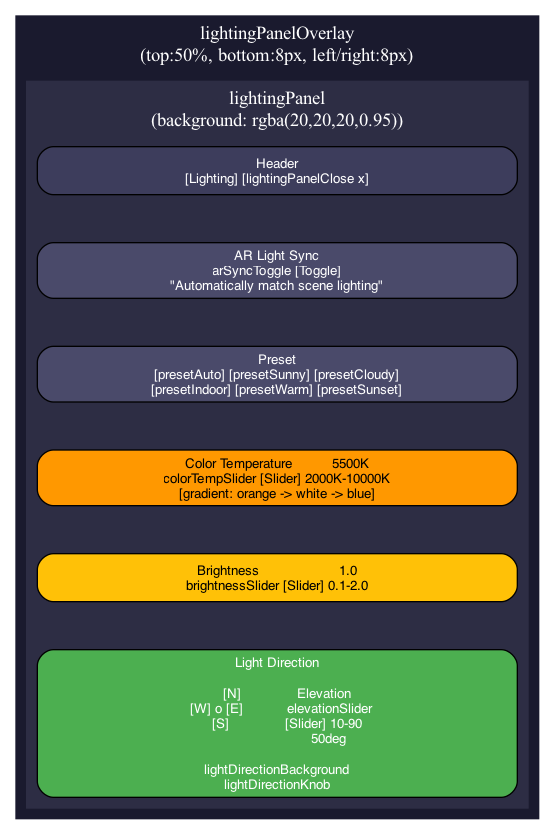
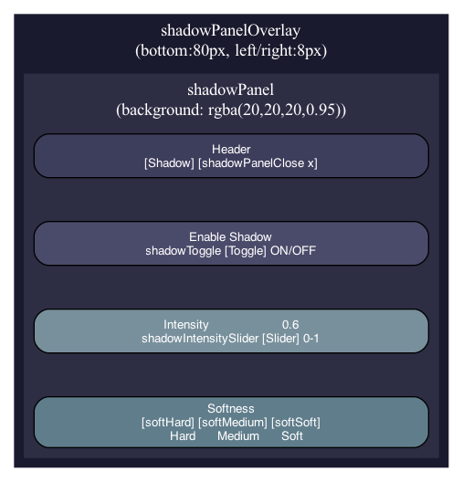
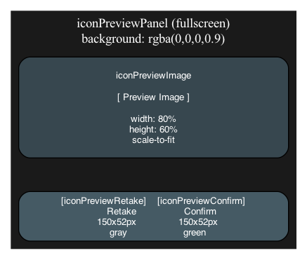
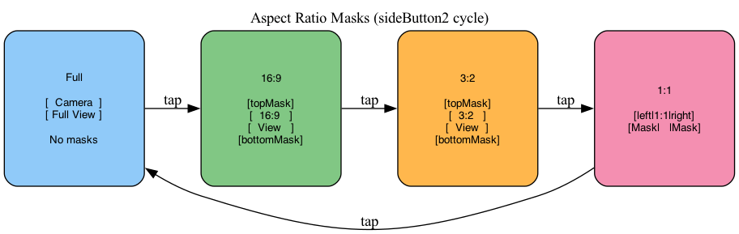

# ARCamera UI レイアウト図

## 画面構成



**配置概要:**

| 要素 | 位置 |
|------|------|
| alertBar | 上部 (top: 76px) |
| topPanel | 上部 (top: 60px) |
| sidePanel | 左中央 (top: 50%, left: 16px) |
| galleryThumbnail | 左下 (bottom: 90px, left: 24px) |
| bottomPanel | 下部 (bottom: 220px) |
| captureButton | 中央下 (margin-bottom: 80px) |

---

## 座標・サイズ仕様

### topPanel

```
位置:
  - top: 60px (Safe Area考慮)
  - left: 16px
  - right: 16px

サイズ:
  - height: 64px

スタイル:
  - background: rgba(128, 128, 128, 0.5)
  - border-radius: 8px
  - padding: 0 8px

ボタン:
  - サイズ: 64x64px
  - 配置: space-around
  - アイコンパディング: 14px
```

### sidePanel

```
位置:
  - top: 50% (translate: 0 -50% で垂直中央)
  - left: 16px

サイズ:
  - width: 72px
  - height: auto (コンテンツ依存)

スタイル:
  - background: rgba(128, 128, 128, 0.5)
  - border-radius: 10px
  - padding: 12px 0

ボタン:
  - サイズ: 58x58px
  - margin: 6px 0
```

### bottom-panel (AvaterSlot)

```
位置:
  - bottom: 220px
  - left: 16px
  - right: 16px

サイズ:
  - height: 64px

スタイル:
  - background: rgba(128, 128, 128, 0.5)
  - border-radius: 10px
  - overflow: hidden

スロットボタン:
  - サイズ: 52x52px
  - margin: 0 8px
  - border-radius: 50%

選択状態:
  - border: 2px solid rgba(80, 180, 255, 1)
```

### captureButton

```
位置:
  - 中央下 (flex-endで下揃え)
  - margin-bottom: 80px
  - margin-top: 24px

サイズ:
  - 全体: 120x120px
  - 内側円: 90x90px
  - 外枠: 120x120px

プログレスリング:
  - サイズ: 120x120px
  - ボーダー幅: 5px
  - 色: rgba(255, 0, 0, 1) (進捗)
  - 背景色: rgba(255, 0, 0, 0.2)
```

### galleryThumbnail

```
位置:
  - bottom: 90px
  - left: 24px

サイズ:
  - 80x80px

スタイル:
  - border-radius: 8px
  - border: 3px solid rgba(255, 255, 255, 0.8)
  - background: #222
```

### alertBar

```
位置:
  - top: 76px (topPanelの上)
  - left: 12px
  - right: 12px

サイズ:
  - min-height: 48px

スタイル:
  - border-radius: 8px
  - padding: 10px 16px

タイプ別背景:
  - warning: rgba(255, 200, 0, 0.95)
  - error: rgba(220, 60, 60, 0.95)
  - info: rgba(80, 180, 220, 0.95)
```

---

## ライティングパネルレイアウト



### ライティングパネル座標

```
オーバーレイ:
  - top: 50%
  - bottom: 8px
  - left: 8px
  - right: 8px

パネル:
  - max-height: 100% (オーバーレイ内)
  - background: rgba(20, 20, 20, 0.95)
  - border-radius: 10px
  - padding: 10px
  - overflow: scroll

コンパス:
  - サイズ: 65x65px
  - ノブ: 14x14px

スライダー:
  - 高さ: 16px
  - ドラッガー: 14x14px
  - トラック高さ: 4px
```

---

## シャドウパネルレイアウト



---

## アイコンプレビューパネル



### ボタンサイズ

```
プレビューボタン:
  - width: 150px
  - height: 52px
  - border-radius: 26px (ピル型)
  - margin: 0 16px
  - font-size: 18px

撮り直す:
  - background: rgba(100, 100, 100, 0.9)
  - color: white

確定:
  - background: rgba(80, 180, 80, 0.95)
  - color: white
```

---

## アスペクト比マスク



sideButton2のタップでFull → 16:9 → 3:2 → 1:1 → Full... とサイクルする。

| モード | マスク配置 | 説明 |
|--------|-----------|------|
| Full | なし | カメラのフルビュー |
| 16:9 | topMask + bottomMask | 上下にマスク |
| 3:2 | topMask + bottomMask | 上下にマスク（16:9より狭い） |
| 1:1 | leftMask + rightMask | 左右にマスク（正方形） |

マスクの配置はC#側で動的に計算:
- `UpdateAspectMask()` メソッドで画面サイズとアスペクト比から計算
- VisualElementのstyle.top/bottom/left/right/width/heightを直接設定
