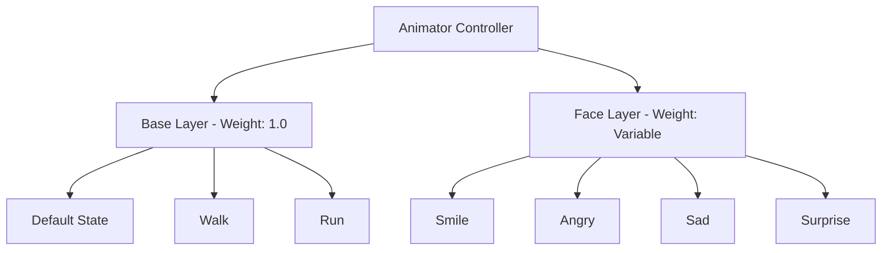

# Face System 技術仕様

アバターの表情をリアルタイムで制御し、UI と連携して直感的な操作を提供する表情システムの実装仕様です。

## システム構成

表情システムは以下の3つのコンポーネントで構成されます：

1. **FaceController**: 表情アニメーション制御の中核
2. **FaceUIManager**: UI の自動生成と管理
3. **ButtonFaceAction**: ボタンと表情の連携

## FaceController

### クラス設計
```csharp
[RequireComponent(typeof(Animator))]
public class FaceController : MonoBehaviour
{
    [SerializeField] private AnimationClip[] faceClips;
    [SerializeField] private int faceLayerIndex = 0;
    [SerializeField] private float fadeOutSpeed = 5f;
    public bool keepFace = false;
}
```

### 表情アニメーションの命名規則

**重要**: AnimationClip の名前は Animator Controller 内のステート名と完全一致する必要があります。

```csharp
// 初期化時にステート名をハッシュ化
foreach (var clip in faceClips)
{
    if (clip != null)
    {
        string stateName = $"Base Layer.{clip.name}";
        int hash = Animator.StringToHash(stateName);
        stateHashByName[clip.name] = hash;
    }
}
```

### 表情切り替えメカニズム

#### SetFace メソッド
```csharp
public void SetFace(string faceName)
{
    if (stateHashByName.TryGetValue(faceName, out int hash))
    {
        animator.CrossFade(hash, 0.2f, faceLayerIndex);
        layerWeight = 1f;
    }
}
```

**動作説明**:
1. 表情名からステートハッシュを取得
2. CrossFade で 0.2 秒かけて滑らかに遷移
3. レイヤーウェイトを最大値に設定

### keepFace とフェードアウト挙動

#### フェードアウト制御
```csharp
void Update()
{
    if (!keepFace && layerWeight > 0f)
    {
        // 時間経過で表情を元に戻す
        layerWeight = Mathf.Max(0f, layerWeight - fadeOutSpeed * Time.deltaTime);
        animator.SetLayerWeight(faceLayerIndex, layerWeight);
    }
}
```

**挙動パターン**:
- `keepFace = true`: 表情を維持
- `keepFace = false`: fadeOutSpeed に従って徐々に元の表情へ
- `fadeOutSpeed = 5`: 約 0.2 秒でフェードアウト完了

### Animator レイヤー構成



**レイヤー設定**:
- **Base Layer**: 基本動作（常にWeight=1.0）
- **Face Layer**: 表情専用（Weight=0.0〜1.0で可変）
- **Blend Mode**: Override（表情が基本動作を上書き）

## FaceUIManager

### UI 自動生成システム

#### 初期化処理
```csharp
void Start()
{
    if (faceController != null)
    {
        GenerateFaceButtons();
    }
}
```

#### ボタン生成ロジック
```csharp
private void GenerateFaceButtons()
{
    // 既存ボタンをクリア
    foreach (Transform child in buttonContainer)
    {
        Destroy(child.gameObject);
    }
    
    // 表情ごとにボタン生成
    foreach (string faceName in faceController.FaceNames)
    {
        GameObject button = Instantiate(buttonPrefab, buttonContainer);
        
        // テキスト設定
        var text = button.GetComponentInChildren<Text>();
        if (text != null) text.text = faceName;
        
        // ButtonFaceAction 設定
        var action = button.GetComponent<ButtonFaceAction>();
        if (action != null)
        {
            action.faceController = faceController;
            action.faceName = faceName;
        }
    }
}
```

### UI レイアウトと更新

#### スクロールビューの自動調整
```csharp
private void AdjustScrollView()
{
    var layoutGroup = buttonContainer.GetComponent<HorizontalLayoutGroup>();
    if (layoutGroup != null)
    {
        // ボタン数に応じてコンテナサイズを調整
        float totalWidth = buttonCount * (buttonWidth + spacing);
        buttonContainer.sizeDelta = new Vector2(totalWidth, buttonContainer.sizeDelta.y);
    }
}
```

#### 表情状態の視覚フィードバック
```csharp
public void UpdateButtonVisuals(string activeFaceName)
{
    foreach (var button in GetComponentsInChildren<Button>())
    {
        var action = button.GetComponent<ButtonFaceAction>();
        if (action != null)
        {
            // アクティブな表情のボタンをハイライト
            bool isActive = action.faceName == activeFaceName;
            button.interactable = !isActive;
            
            var image = button.GetComponent<Image>();
            if (image != null)
            {
                image.color = isActive ? activeColor : defaultColor;
            }
        }
    }
}
```

## ButtonFaceAction

### ボタンと表情の連携

```csharp
public class ButtonFaceAction : MonoBehaviour
{
    public FaceController faceController;
    public string faceName;
    
    void Start()
    {
        var button = GetComponent<Button>();
        if (button != null)
        {
            button.onClick.AddListener(OnButtonClick);
        }
    }
    
    void OnButtonClick()
    {
        if (faceController != null && !string.IsNullOrEmpty(faceName))
        {
            faceController.SetFace(faceName);
            
            // UI マネージャーに通知
            var uiManager = FindObjectOfType<FaceUIManager>();
            if (uiManager != null)
            {
                uiManager.UpdateButtonVisuals(faceName);
            }
        }
    }
}
```

## 実装パターンと使用例

### 基本的な使用方法
```csharp
// Inspector で設定
public class AvatarSetup : MonoBehaviour
{
    public FaceController faceController;
    public AnimationClip[] expressions;
    
    void Start()
    {
        // 表情クリップを設定
        faceController.faceClips = expressions;
        
        // 初期表情を設定
        faceController.SetFace("Smile");
    }
}
```

### プログラムからの制御
```csharp
public class EmotionManager : MonoBehaviour
{
    private FaceController face;
    
    void Start()
    {
        face = GetComponent<FaceController>();
    }
    
    public void ReactToEvent(string eventType)
    {
        switch (eventType)
        {
            case "Victory":
                face.SetFace("Happy");
                face.keepFace = true;  // 維持
                break;
                
            case "Damage":
                face.SetFace("Pain");
                face.keepFace = false; // 自動で戻る
                break;
        }
    }
}
```

### カスタム UI との統合
```csharp
public class CustomFaceUI : MonoBehaviour
{
    public FaceController faceController;
    public Slider emotionSlider;
    
    void Update()
    {
        // スライダー値に応じて表情を変更
        float value = emotionSlider.value;
        
        if (value < 0.33f)
            faceController.SetFace("Sad");
        else if (value < 0.66f)
            faceController.SetFace("Normal");
        else
            faceController.SetFace("Happy");
    }
}
```

## パフォーマンス最適化

### アニメーション最適化
1. **クリップ圧縮**: Humanoid リグで最小キーフレーム
2. **レイヤー制限**: 必要最小限のレイヤー数
3. **LOD 対応**: 距離に応じた表情更新頻度の調整

### メモリ管理
```csharp
// 使用頻度の低い表情をアンロード
public void UnloadRareExpressions()
{
    var rareClips = new[] { "Surprise", "Disgust" };
    foreach (var clipName in rareClips)
    {
        if (loadedClips.ContainsKey(clipName))
        {
            Resources.UnloadAsset(loadedClips[clipName]);
            loadedClips.Remove(clipName);
        }
    }
}
```

## トラブルシューティング

### よくある問題と解決方法

#### 表情が切り替わらない
**原因**: ステート名の不一致
**解決**: 
```csharp
// デバッグログで確認
Debug.Log($"Clip name: {clip.name}");
Debug.Log($"State name: Base Layer.{clip.name}");
```

#### フェードアウトが機能しない
**原因**: レイヤーウェイトの設定ミス
**解決**: Animator の Layer Settings で Weight を確認

#### UI ボタンが生成されない
**原因**: FaceController の参照が null
**解決**: Inspector で FaceController を設定

## 設定ガイドライン

### Animator Controller の設定
1. Face Layer を追加（Weight: 0, Blending: Override）
2. 各表情のステートを作成
3. Animation Clip をステートに割り当て
4. Any State からの遷移を設定（Has Exit Time: false）

### 表情クリップの準備
1. モデルの表情ブレンドシェイプをキーフレーム化
2. クリップ長は 1 フレームで十分（ポーズ用）
3. Loop Time は無効化

### UI プレハブの構成
```
FaceButtonPrefab
├── Button Component
├── ButtonFaceAction Component
├── Image Component
└── Text (Child)
    └── Text Component
```

## 拡張機能の実装例

### 表情のブレンド
```csharp
public void BlendFaces(string face1, string face2, float blend)
{
    animator.SetLayerWeight(faceLayerIndex, 1f);
    
    // 2つの表情を補間
    int hash1 = Animator.StringToHash($"Base Layer.{face1}");
    int hash2 = Animator.StringToHash($"Base Layer.{face2}");
    
    animator.Play(hash1, faceLayerIndex, 0);
    animator.SetFloat("BlendWeight", blend);
}
```

### 表情の保存/読み込み
```csharp
[System.Serializable]
public class FacePreset
{
    public string name;
    public string[] faceSequence;
    public float[] durations;
}

public void PlayFaceSequence(FacePreset preset)
{
    StartCoroutine(PlaySequence(preset));
}
```

## 関連ファイル

### 実装
- [`FaceController.cs`](../aiCam/Assets/Scripts/FaceController.cs) - 表情制御コア
- [`FaceUIManager.cs`](../aiCam/Assets/Scripts/FaceUIManager.cs) - UI 管理
- [`ButtonFaceAction.cs`](../aiCam/Assets/Scripts/ButtonFaceAction.cs) - ボタン連携
- [`FaceUIManagerEditor.cs`](../aiCam/Assets/Editor/FaceUIManagerEditor.cs) - エディタ拡張

### アセット
- Animation Clips - `Assets/Kyoko/Animations/Face/`
- Animator Controller - `Assets/Kyoko/Animators/`
- UI Prefabs - `Assets/Prefabs/UI/`

## 関連ドキュメント

- [Implemented Requirements](./Implemented-Requirements.md) - 全体要件
- [Unity Animation System](https://docs.unity3d.com/Manual/AnimationSection.html)
- [Animator Layers](https://docs.unity3d.com/Manual/AnimatorLayers.html)