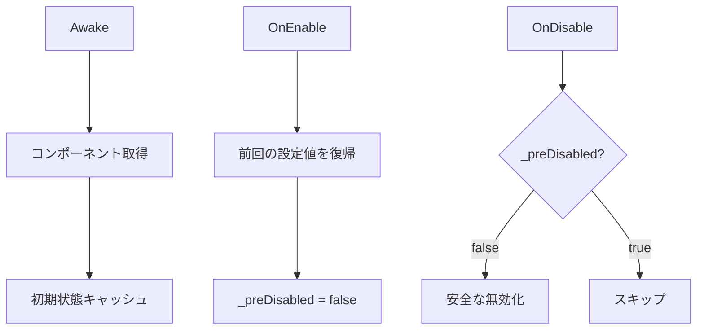

# Occlusion Management 技術仕様

AR Foundation の AROcclusionManager を安全に制御し、環境深度と人物セグメンテーションによるオクルージョンを実現する実装仕様です。

## 概要

OcclusionToggle クラスは、Unity の AR Foundation における環境オクルージョン機能を管理します。アプリケーションのライフサイクル全体を通じて、安全かつ効率的にオクルージョン機能の有効/無効を切り替えます。

## アーキテクチャ

### クラス構成
```csharp
[DisallowMultipleComponent]
[RequireComponent(typeof(AROcclusionManager))]
public sealed class OcclusionToggle : MonoBehaviour
```

### 主要プロパティ
- **occ**: AROcclusionManager への参照
- **depthWhenOn**: 有効時の環境深度品質（デフォルト: Medium）
- **_lastRequested**: 再開時に復帰する深度モード
- **_preDisabled**: 終了前の明示的無効化フラグ

## 公開API詳細

### EnableDepth()
```csharp
public void EnableDepth()
{
    _lastRequested = depthWhenOn;
    TrySetAll(
        env: depthWhenOn,
        humanStencil: HumanSegmentationStencilMode.Fastest,
        humanDepth: HumanSegmentationDepthMode.Fastest,
        pref: OcclusionPreferenceMode.PreferEnvironmentOcclusion);
}
```
**動作**: 
- 環境深度を指定品質で有効化
- 人物セグメンテーションも同時に有効化
- 環境オクルージョンを優先

### DisableDepth()
```csharp
public void DisableDepth()
{
    _lastRequested = EnvironmentDepthMode.Disabled;
    TrySetAll(
        env: EnvironmentDepthMode.Disabled,
        humanStencil: HumanSegmentationStencilMode.Disabled,
        humanDepth: HumanSegmentationDepthMode.Disabled,
        pref: OcclusionPreferenceMode.NoOcclusion);
}
```
**動作**:
- すべてのオクルージョン機能を段階的に無効化
- 次回有効化時まで状態を保持

### DisableDepthNow()
```csharp
public void DisableDepthNow()
{
    _lastRequested = EnvironmentDepthMode.Disabled;
    _preDisabled = true;
    // 即座に無効化処理
}
```
**動作**:
- OnDisable での二重処理を防ぐフラグ設定
- アプリ終了時の安全な無効化

### CurrentDepthMode
```csharp
public EnvironmentDepthMode CurrentDepthMode => 
    occ ? occ.requestedEnvironmentDepthMode : EnvironmentDepthMode.Disabled;
```
**動作**:
- 現在の環境深度モードを取得
- null安全性を保証

## ライフサイクル処理

### Awake/OnEnable/OnDisable の挙動



### 初期化シーケンス
1. **Awake**: AROcclusionManager の参照を取得
2. **CacheCurrentModes**: 現在の設定を保存
3. **OnEnable**: 保存された設定で復帰

### 終了シーケンス
1. **DisableDepthNow 呼び出し**: _preDisabled フラグ設定
2. **OnDisable**: フラグチェックによる二重停止防止
3. **OnDestroy**: 最終クリーンアップ

## 例外ハンドリング方針

### レース条件の回避
```csharp
private void TrySetAll(
    EnvironmentDepthMode env,
    HumanSegmentationStencilMode humanStencil,
    HumanSegmentationDepthMode humanDepth,
    OcclusionPreferenceMode pref)
{
    if (!occ || !occ.enabled) return; // null/無効チェック
    
    try 
    {
        occ.requestedEnvironmentDepthMode = env;
        occ.requestedHumanStencilMode = humanStencil;
        occ.requestedHumanDepthMode = humanDepth;
        occ.requestedOcclusionPreferenceMode = pref;
    }
    catch (Exception e)
    {
        Debug.LogError($"[OcclusionToggle] 設定エラー: {e.Message}");
    }
}
```

### エラー処理戦略
1. **Null チェック**: すべての外部参照を使用前に検証
2. **状態チェック**: コンポーネントの有効状態を確認
3. **例外キャッチ**: AR サブシステムの例外を捕捉
4. **フォールバック**: エラー時は無効状態にフォールバック

## 使用例

### 基本的な使用方法
```csharp
public class ARSceneManager : MonoBehaviour
{
    private OcclusionToggle occlusionToggle;
    
    void Start()
    {
        occlusionToggle = FindObjectOfType<OcclusionToggle>();
    }
    
    public void OnOcclusionButtonClicked()
    {
        if (occlusionToggle.CurrentDepthMode == EnvironmentDepthMode.Disabled)
        {
            occlusionToggle.EnableDepth();
            Debug.Log("オクルージョン有効化");
        }
        else
        {
            occlusionToggle.DisableDepth();
            Debug.Log("オクルージョン無効化");
        }
    }
}
```

### パフォーマンス適応型制御
```csharp
public class PerformanceManager : MonoBehaviour
{
    private OcclusionToggle occlusion;
    
    void Update()
    {
        // FPS に応じて品質を調整
        float fps = 1f / Time.deltaTime;
        if (fps < 30f && occlusion.CurrentDepthMode != EnvironmentDepthMode.Disabled)
        {
            // パフォーマンス低下時は無効化
            occlusion.DisableDepth();
        }
    }
}
```

## パフォーマンス考慮事項

### 深度モード別の負荷
| モード | GPU負荷 | 精度 | 推奨用途 |
|--------|---------|------|----------|
| Disabled | なし | - | 非AR表示時 |
| Fastest | 低 | 低 | 低スペックデバイス |
| Medium | 中 | 中 | 標準的な使用 |
| Best | 高 | 高 | 高精度が必要な場合 |

### 最適化のヒント
1. **動的切り替え**: シーンの複雑さに応じてモードを変更
2. **デバイス判定**: ハードウェアスペックに応じた初期設定
3. **バッテリー考慮**: 長時間使用時は品質を下げる

## トラブルシューティング

### よくある問題と解決策

#### オクルージョンが有効にならない
- AR Session が開始されているか確認
- デバイスが深度センサーに対応しているか確認
- AROcclusionManager が有効になっているか確認

#### アプリ終了時にクラッシュする
- DisableDepthNow() を明示的に呼び出す
- OnApplicationPause でも無効化処理を実装

#### パフォーマンスが低下する
- depthWhenOn を Fastest に設定
- 人物セグメンテーションを無効化

## 関連ファイル

- **実装**: [`OcclusionToggle.cs`](../aiCam/Assets/Scripts/OcclusionToggle.cs)
- **エディタ拡張**: [`OcclusionPreShutdownEditor.cs`](../aiCam/Assets/Editor/OcclusionPreShutdownEditor.cs)
- **使用例**: [`ARPhotoController.cs`](../aiCam/Assets/Scripts/ARPhotoController.cs)

## 関連ドキュメント

- [Implemented Requirements](./Implemented-Requirements.md) - 全体要件
- [Unity AR Foundation Documentation](https://docs.unity3d.com/Packages/com.unity.xr.arfoundation@6.2/)
- [AROcclusionManager API Reference](https://docs.unity3d.com/Packages/com.unity.xr.arfoundation@6.2/api/UnityEngine.XR.ARFoundation.AROcclusionManager.html)