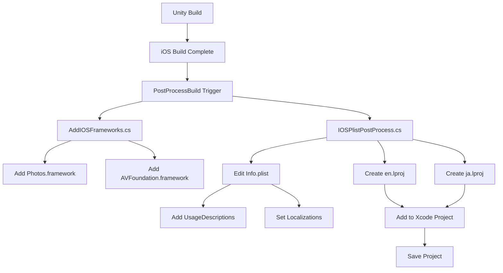

# iOS Build Postprocess 技術仕様

iOS ビルド後に自動実行される後処理により、必要な権限設定、ローカライズ、フレームワークを自動的に構成します。

## 概要

Unity の PostProcessBuild 属性を使用して、iOS ビルド完了後に以下の処理を自動実行：
1. Info.plist への UsageDescription 追加
2. 多言語対応の InfoPlist.strings 生成
3. 必須フレームワークの追加
4. Xcode プロジェクトへのリソース統合

## 実装ファイル

### IOSPlistPostProcess.cs
Info.plist の編集とローカライズファイルの生成を担当します。

```csharp
[PostProcessBuild(int.MaxValue)]  // 最後に実行して他の変更を上書きしない
public static void OnPostProcessBuild(BuildTarget target, string path)
```

### AddIOSFrameworks.cs
必須フレームワークを Xcode プロジェクトに追加します。

```csharp
[PostProcessBuild(1)]
public static void OnPostProcessBuild(BuildTarget target, string path)
```

## UsageDescription キーの管理

### 既存値を上書きしない設計

```csharp
private static void AddDefaultIfMissing(PlistElementDict root, string key, string defaultValue)
{
    if (!root.values.ContainsKey(key))
    {
        root.SetString(key, defaultValue);
    }
}
```

**設計理由**:
- プロダクト固有のブランド文言を保護
- 翻訳済みテキストの破壊を防止
- カスタマイズの自由度を確保

### 追加される権限キー

| キー | デフォルト説明（英/日） | 用途 |
|------|------------------------|------|
| NSCameraUsageDescription | This app uses the camera for AR. / このアプリはAR表示のためにカメラを使用します。 | ARカメラ |
| NSPhotoLibraryAddUsageDescription | This app saves captured photos to your library. / 撮影した写真をフォトライブラリに保存します。 | 写真保存 |
| NSMicrophoneUsageDescription | This app uses the microphone when recording video. / 動画録画時にマイクを使用します。 | 動画録音 |

## ローカライズ処理

### 英/日 InfoPlist.strings の自動生成

#### ディレクトリ構造
```
[Xcode Project]/
├── en.lproj/
│   └── InfoPlist.strings
└── ja.lproj/
    └── InfoPlist.strings
```

#### 生成コード
```csharp
private static void WriteStrings(string buildPath, string lang, (string key, string value)[] pairs)
{
    string lprojPath = Path.Combine(buildPath, $"{lang}.lproj");
    Directory.CreateDirectory(lprojPath);
    
    string stringsPath = Path.Combine(lprojPath, "InfoPlist.strings");
    using (var writer = new StreamWriter(stringsPath, false, System.Text.Encoding.UTF8))
    {
        foreach (var (key, value) in pairs)
        {
            writer.WriteLine($"\"{key}\" = \"{value}\";");
        }
    }
}
```

### 英語版 (en.lproj/InfoPlist.strings)
```
"NSCameraUsageDescription" = "This app uses the camera for AR.";
"NSPhotoLibraryAddUsageDescription" = "This app saves captured photos to your Photo Library.";
"NSMicrophoneUsageDescription" = "This app uses the microphone when recording video.";
```

### 日本語版 (ja.lproj/InfoPlist.strings)
```
"NSCameraUsageDescription" = "このアプリはAR表示のためにカメラを使用します";
"NSPhotoLibraryAddUsageDescription" = "撮影した写真をフォトライブラリに保存します";
"NSMicrophoneUsageDescription" = "動画録画時にマイクを使用します";
```

## フレームワークの追加

### Photos.framework
```csharp
proj.AddFrameworkToProject(targetGuid, "Photos.framework", false);
```
**用途**:
- PHPhotoLibrary による写真保存
- アルバムへのアクセス
- メタデータの読み書き

### AVFoundation.framework
```csharp
proj.AddFrameworkToProject(targetGuid, "AVFoundation.framework", false);
```
**用途**:
- 動画の録画
- オーディオセッション管理
- メディアフォーマット処理

## CFBundleLocalizations と DevelopmentRegion

### Info.plist への言語設定
```csharp
// 開発言語を英語に設定
root.SetString("CFBundleDevelopmentRegion", "en");

// サポート言語のリスト
var loc = root.CreateArray("CFBundleLocalizations");
loc.AddString("en");
loc.AddString("ja");
```

**効果**:
- App Store での言語表示
- システム設定に応じた言語切り替え
- フォールバック言語の指定

## Xcode プロジェクトへの統合

### lproj フォルダの追加
```csharp
string targetGuid = proj.GetUnityMainTargetGuid();

// en.lproj を追加
if (Directory.Exists(enPath))
{
    string guid = proj.AddFolderReference(enPath, "en.lproj", PBXSourceTree.Source);
    proj.AddFileToBuild(targetGuid, guid);
}

// ja.lproj を追加
if (Directory.Exists(jaPath))
{
    string guid = proj.AddFolderReference(jaPath, "ja.lproj", PBXSourceTree.Source);
    proj.AddFileToBuild(targetGuid, guid);
}
```

## 処理フロー



## カスタマイズ方法

### 権限文言の変更
Player Settings または直接 Info.plist を編集：
```xml
<key>NSCameraUsageDescription</key>
<string>カスタムメッセージ</string>
```

### 言語の追加
IOSPlistPostProcess.cs を拡張：
```csharp
// 韓国語を追加する例
WriteStrings(path, "ko", new []
{
    ("NSCameraUsageDescription", "이 앱은 AR을 위해 카메라를 사용합니다"),
    // ...
});
loc.AddString("ko");
```

### フレームワークの追加
AddIOSFrameworks.cs に追記：
```csharp
proj.AddFrameworkToProject(targetGuid, "CoreML.framework", true);  // optional = true
```

## トラブルシューティング

### よくある問題

#### ビルドエラー: フレームワークが見つからない
**原因**: Xcode のバージョン不一致
**解決**: 最新の Xcode をインストール

#### 権限ダイアログが英語で表示される
**原因**: デバイスの言語設定
**解決**: CFBundleLocalizations を確認

#### カスタム文言が反映されない
**原因**: PostProcessBuild の実行順序
**解決**: 優先度を調整 `[PostProcessBuild(100)]`

## ベストプラクティス

1. **権限文言は具体的に**: 「カメラを使用します」より「AR表示のためにカメラを使用します」
2. **必要最小限の権限**: 使用しない権限は追加しない
3. **ローカライズの一貫性**: すべての言語で同じ意味を保つ
4. **テスト環境の整備**: 複数言語でのテストを自動化

## 関連ファイル

- **実装**: 
  - [`IOSPlistPostProcess.cs`](../aiCam/Assets/Editor/IOSPlistPostProcess.cs)
  - [`AddIOSFrameworks.cs`](../aiCam/Assets/Editor/AddIOSFrameworks.cs)
  - [`IOSPrivacySettings.cs`](../aiCam/Assets/Editor/IOSPrivacySettings.cs)

- **参照**:
  - [`ARPhotoController.cs`](../aiCam/Assets/Scripts/ARPhotoController.cs) - Photos.framework 使用
  - Info.plist - 最終的な設定ファイル

## 関連ドキュメント

- [Implemented Requirements](./Implemented-Requirements.md) - 全体要件
- [Apple Developer - Info.plist Keys](https://developer.apple.com/documentation/bundleresources/information_property_list)
- [Unity - iOS Player Settings](https://docs.unity3d.com/Manual/class-PlayerSettingsiOS.html)